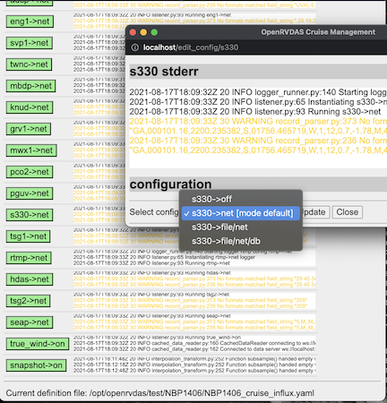

# OpenRVDAS

## Overview

The Open Research Vessel Data Acquisition System (OpenRVDAS) is a
software framework used for building custom data acquisition systems
(DAS).  OpenRVDAS target audiences are oceanographic research vessel
operators and operators of other science-related platforms that have
the need to record streaming data.  OpenRVDAS is capable of reading
data records from serial ports and network-aware sensors, optionally
modifying those data records and streaming either the result to one or
more destinations, including logfiles, network ports, databases, etc.

OpenRVDAS is designed to be modular and extensible, relying on simple
composition of Readers, Transforms and Writers to achieve the needed
datalogging functionality.


## Motivation

The primary purpose of an oceanographic research vessel is to gather
data from sensors. Oceanographic research vessels carry a combination
of oceanographic, meteorological and other specialized sensors. Some
of the more complex sensors (i.e. ADCP, Multibeam, imaging systems)
include specialized data acquisition systems tailored to the
particlular sensor. Many simpler sensors, however, can simply stream
data values over a network port or serial connection.

At present there are limited options for operators wishing to store
and display data from these simple sensors. This task is commonly
referred to as underway data logging.  Most research vessel operators
rely on closed-source, solutions (i.e. SCS, WinFrog) or on dated
datalogging systems (i.e.  dsLog, LDS) for underway data logging.
Both options provide limited support mechanisms, thus bugs are slow to
be resolved and feature requests are slow to be implemented.

OpenRVDAS hopes to provide an alternative underway data logging 
solution that is defined, developed and maintained by the global
oceanographic research community.

OpenRVDAS recognizes that each ship is different, that each ship has a
unique set of sensors and that each ship has a unique way of
operating.  With this understanding, OpenRVDAS does not try provide a
turn-key, one- size-fits-all solution but instead provides research
vessel operators with a modular and extensible toolset for developing
and deploying a custom underway datalogging solution tailored to the
vessel's individual needs.



**DISCLAIMER**: THE SOFTWARE IS PROVIDED “AS IS”, WITHOUT WARRANTY OF
ANY KIND, EXPRESS OR IMPLIED, INCLUDING BUT NOT LIMITED TO THE
WARRANTIES OF MERCHANTABILITY, FITNESS FOR A PARTICULAR PURPOSE AND
NONINFRINGEMENT. IN NO EVENT SHALL THE AUTHORS OR COPYRIGHT HOLDERS BE
LIABLE FOR ANY CLAIM, DAMAGES OR OTHER LIABILITY, WHETHER IN AN ACTION
OF CONTRACT, TORT OR OTHERWISE, ARISING FROM, OUT OF OR IN CONNECTION
WITH THE SOFTWARE OR THE USE OR OTHER DEALINGS IN THE SOFTWARE,
INCLUDING INJURY, LOSS OF LIFE, PROPERTY, SANITY OR CREDIBILITY AMONG
YOUR PEERS WHO WILL TELL YOU THAT YOU REALLY SHOULD HAVE KNOWN BETTER.

## Documentation

Most OpenRVDAS documentation is gathered in the [docs/](docs/) subdirectory of this project. We recommend beginning with [OpenRVDAS Introduction and Overview](docs/intro_and_overview.md), [Introduction to Loggers](docs/intro_to_loggers.md) and [Controlling Loggers](docs/controlling_loggers.md) to get started.

## Installation

OpenRVDAS is written primarily in Python 3.[^1] The installation script at [utils/install_openrvdas.sh](utils/install_openrvrdas.sh)
has been tested on CentOS 7 and 8, Ubuntu 18 and 20, Raspbian and MacOS, but it may also work on other systems.
Please refer to [INSTALL.md](./INSTALL.md) for details.

## Ship/Organization-Dependent Code

Please see the [local/README.md](local/README.md) file for conventions on where and how to organize your institution's configuration and definition files.

## Contributing

Please contact David Pablo Cohn (*david dot cohn at gmail dot com*) - to discuss
opportunities for participating in code development.

## License

This code is made available under the MIT license:

Copyright (c) 2017-2018 David Pablo Cohn

Permission is hereby granted, free of charge, to any person obtaining a copy
of this software and associated documentation files (the "Software"), to deal
in the Software without restriction, including without limitation the rights
to use, copy, modify, merge, publish, distribute, sublicense, and/or sell
copies of the Software, and to permit persons to whom the Software is
furnished to do so, subject to the following conditions:

The above copyright notice and this permission notice shall be included in all
copies or substantial portions of the Software.

THE SOFTWARE IS PROVIDED "AS IS", WITHOUT WARRANTY OF ANY KIND, EXPRESS OR
IMPLIED, INCLUDING BUT NOT LIMITED TO THE WARRANTIES OF MERCHANTABILITY,
FITNESS FOR A PARTICULAR PURPOSE AND NONINFRINGEMENT. IN NO EVENT SHALL THE
AUTHORS OR COPYRIGHT HOLDERS BE LIABLE FOR ANY CLAIM, DAMAGES OR OTHER
LIABILITY, WHETHER IN AN ACTION OF CONTRACT, TORT OR OTHERWISE, ARISING FROM,
OUT OF OR IN CONNECTION WITH THE SOFTWARE OR THE USE OR OTHER DEALINGS IN THE
SOFTWARE.

## Additional Licenses

Highcharts is a software library made available by
[http://www.highcharts.com](http://www.highcharts.com) under the
Creative Commons (CC) Attribution-NonCommercial licence.

  Several of the libraries are included here to support a demonstration
  of how Highcharts may be used to display OpenRVDAS data. **Users of
  OpenRVDAS who wish to use Highcharts are responsible for ensuring that
  they have the proper licenses to use Highcharts in their
  installation.** Please see the [Highcharts Licensing
  FAQ](https://shop.highsoft.com/faq/licensing) for details.

[Leaflet](https://leafletjs.com/) is a software library made available under the [2-clause BSD license](https://github.com/Leaflet/Leaflet/blob/master/LICENSE):

  ```
  Copyright (c) 2010-2018, Vladimir Agafonkin
  Copyright (c) 2010-2011, CloudMade
  All rights reserved.
  
  Redistribution and use in source and binary forms, with or without modification, are
  permitted provided that the following conditions are met:
  
     1. Redistributions of source code must retain the above copyright notice, this list of
        conditions and the following disclaimer.
  
     2. Redistributions in binary form must reproduce the above copyright notice, this list
        of conditions and the following disclaimer in the documentation and/or other materials
        provided with the distribution.
  
  THIS SOFTWARE IS PROVIDED BY THE COPYRIGHT HOLDERS AND CONTRIBUTORS "AS IS" AND ANY
  EXPRESS OR IMPLIED WARRANTIES, INCLUDING, BUT NOT LIMITED TO, THE IMPLIED WARRANTIES OF
  MERCHANTABILITY AND FITNESS FOR A PARTICULAR PURPOSE ARE DISCLAIMED. IN NO EVENT SHALL THE
  COPYRIGHT HOLDER OR CONTRIBUTORS BE LIABLE FOR ANY DIRECT, INDIRECT, INCIDENTAL, SPECIAL,
  EXEMPLARY, OR CONSEQUENTIAL DAMAGES (INCLUDING, BUT NOT LIMITED TO, PROCUREMENT OF
  SUBSTITUTE GOODS OR SERVICES; LOSS OF USE, DATA, OR PROFITS; OR BUSINESS INTERRUPTION)
  HOWEVER CAUSED AND ON ANY THEORY OF LIABILITY, WHETHER IN CONTRACT, STRICT LIABILITY, OR
  TORT (INCLUDING NEGLIGENCE OR OTHERWISE) ARISING IN ANY WAY OUT OF THE USE OF THIS
  SOFTWARE, EVEN IF ADVISED OF THE POSSIBILITY OF SUCH DAMAGE.
  ```

[^1]: Recommended version of Python is 3.6 or higher, but most listener code has been verified
to run on 3.5 and higher. Server code such as `logger_manager.py` may experience problems on 
3.5 due to changes in the async module.
