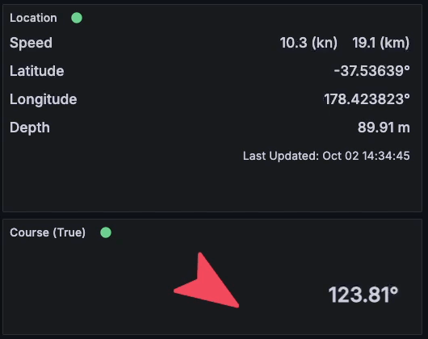
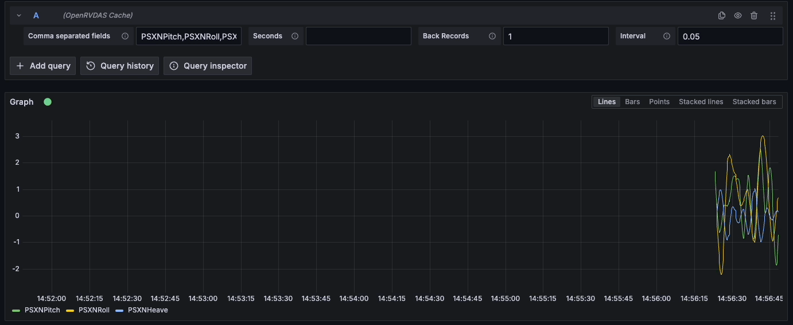

# OpenRVDAS Cache Datasource

Streaming datasources allow Grafana panels to re-render when new data is available without triggering queries across the whole dashboard. OpenRVDAS makes it easy to store parsed values in it's cache data server which can be accessed by a websocket connection. Combining the two allows you to create panels that update in close to real-time without involving the database.




_Streaming positional data (visualised with the [Volkov labs - Business Text Panel](https://volkovlabs.io/plugins/business-text/))_


_Exploring the datasource, using multiple fields with sub-second intervals_


This datasource is built from a [Grafana example](https://github.com/grafana/grafana-plugin-examples/tree/main/examples/datasource-streaming-backend-websocket/streaming-backend-websocket-plugin) template


## Getting started

You must build the plugin before it can be added to grafana.

1. Install dependencies
```BASH
npm install
```
2. Build plugin in development mode or run in watch mode
```BASH
npm run dev
```
or
```BASH
npm run watch
```
3. Build plugin in production mode
```BASH
npm run build
```
4. Run Grafana demo server at `localhost:3000`
```BASH
docker compose up
```
5. Configure datasource from `Home > Connections > Data sources > OpenRVDAS Cache`


## Configuring In Grafana

- __Comma separated fields__: Names of fields in the cache server, e.g. `GPSLat,GPSLon` This can be a multi-value dashboard variable if the `text` part of the variable returns field names present in the cache server e.g. `${MyVariable}`
- __Seconds__: Number of seconds of data to return on first load
- __Back Records__: Total records to return on first load (ignoring seconds value)
- __Interval__: Time between calls to the cache server, a higher value is likely to return "batches" of results


## Deploying In Production

You will need to include the `/dist` folder contents inside an `openrvdas-cache` folder in your grafana plugin directory. There is an example of this in the docker-compose.yaml file of this package which mounts the `/dist` folder inside `/var/lib/grafana/plugins/openrvdas-cache`. There is documentation to help on [grafana docs](https://grafana.com/docs/grafana/latest/administration/plugin-management/#install-plugin-on-local-grafana)

__You will need to allow unsigned plugins__


## TODO
- This datasource doesn't support annotations yet despite the attempt to implement it in the source code
- There are a lot of tests that came with the example datasource which have so far been ignored


## Grafana Custom Plugin Resources
- [Build a data source plugin tutorial](https://grafana.com/tutorials/build-a-data-source-plugin)
- [Grafana documentation](https://grafana.com/docs/)
- [Grafana Tutorials](https://grafana.com/tutorials/) - Grafana Tutorials are step-by-step guides that help you make the most of Grafana
- [Grafana UI Library](https://developers.grafana.com/ui) - UI components to help you build interfaces using Grafana Design System
