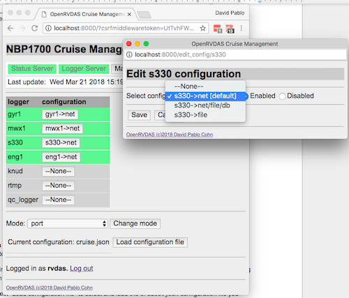
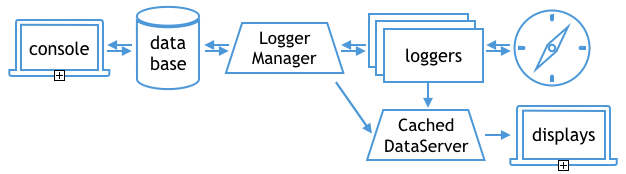

# OpenRVDAS Controlling Loggers
© 2018-2020 David Pablo Cohn - DRAFT 2020-02-14

## Overview

The [OpenRVDAS Introduction and Overview](intro_and_overview.md) document provides an introduction to the OpenRVDAS framework, and [Introduction to Loggers](intro_to_loggers.md) provides an introduction to the process of running *individual* loggers.

This document describes operation of the [Logger Manager](../server/logger_manager.py), a multifaceted script that allows running, controlling and monitoring entire sets of loggers.

## Table of Contents

* [The high-order bits](#the-high-order-bits)
* [Cruises, modes and configurations](#cruises-modes-and-configurations)
* [What the logger manager does](#what-the-logger-manager-does)
* [Running from the command line](#running-from-the-command-line)
* [Driving widget-based data display](#driving-widget-based-data-display)
* [Web-based control of the logger manager](#web-based-control-of-the-logger-manager)


## The high-order bits

The ``listen.py`` script, described in the [Introduction to listen.py doc](listen_py.md) will run a single logger defined either from command line parameters, or by loading a logger configuration file. 

The ``logger_manager.py`` script take a more complicated file (called a "cruise definition file") that consists not only of a list of named configurations, but also of "modes" such as "off", "in port" and "underway", specifying which configurations should be running in which mode. It supports an API that lets one control and monitor it from the command line or via a web interface.

  In the default installation, a logger manager and its companion, the cached data server, are run by the system's ``supervisor`` daemon.

Below, we go into greater detail on these points.

## Cruises, modes and configurations

Before we dive into the use of ``logger_manager.py``, it's worth pausing for a moment to introduce some concepts that underlie the structure of the logger manager. _(Note: much of this section could be moved to [OpenRVDAS Configuration Files](configuration_files.md))._

-   **Logger configuration** - This is a definition for a set of Readers, Transforms and Writers feeding into each other, such as would be read using the --config argument of the listen.py script. In OpenRVDAS, each logger configuration that is active runs as its own daemon process.  The sample logger configuration below ("knud-\>net") reads NMEA data from the Knudsen serial port, timestamps and labels the record, then broadcasts it via UDP:

```
  knud->net: 
    host_id: knud.host
    name: knud->net
    readers: 
      class: SerialReader
      kwargs: 
        port: /tmp/tty_knud
        baudrate: 9600
    transforms: 
    - class: TimestampTransform
    - class: PrefixTransform
      kwargs: 
        prefix: knud
    writers: 
      class: UDPWriter
      kwargs: 
        port: 6224
```
-   **Cruise mode (or just "mode")** - Logger configurations can be grouped into logical collections that will be active at any given time. Certain logger configurations will be running when a vessel is in port; another set may be running while the vessel is at sea, but within territorial waters; yet another when it is fully underway. The mode definition below indicates that when "port" mode is active, the configurations "gyr1-\>net", "mwx1-\>net", "s330-\>net" and "eng1-\>net" should be running:

```
  modes:  
    off:  
      gyr1: gyr1->off 
      mwx1: mwx1->off 
      s330: s330->off 
      eng1: eng1->off 
      knud: knud->off 
      rtmp: rtmp->off 
    port:  
      gyr1: gyr1->net 
      mwx1: mwx1->net 
      s330: s330->net 
      eng1: eng1->net 
      knud: knud->off 
      rtmp: rtmp->off 
    underway:
      gyr1: gyr1->file/net/db 
      mwx1: mwx1->file/net/db 
      s330: s330->file/net/db 
      eng1: eng1->file/net/db 
      knud: knud->file/net/db 
      rtmp: rtmp->file/net/db
```
-   **Cruise configuration** - (or just "configuration" when we're being sloppy). This is the file/JSON/YAML structure that contains everything the logger manager needs to know about running a cruise. In addition to containing cruise metadata (cruise id, provisional start and ending dates), a cruise configuration file (such as in [test/NBP1406/NBP1406\_cruise.yaml](../test/NBP1406/NBP1406_cruise.yaml)), contains a dict of all the logger configurations that are to be run on a particular vessel deployment, along with definitions for all the modes into which those logger configurations are grouped.
  
It is worth noting that strictly speaking, a "logger" does not exist as a separate entity in OpenRVDAS. It is just a convenient way of thinking about a set of configurations that are responsible for a given data stream, e.g. Knudsen data, or a GPS feed. This is evident when looking at the [sample cruise definition file](../test/NBP1406/NBP1406_cruise.yaml), as the logger definition ("knud") is just a list of the configurations that are responsible for handling the data that comes in from a particular serial port.

```
knud:
  configs:
  - knud->off,
  - knud->net,
  - knud->file/net/db
```
Perusing a complete cruise configuration file such as [test/NBP1406/NBP1406_cruise.yaml](../test/NBP1406/NBP1406_cruise.yaml) may be useful for newcomers to the system.

## What the logger manager does

* It spawns a command line console interface to a database/backing store where it will store/retrieve information on which logger configurations should be running and which are. By default, this database will be an in-memory, transient store, unless overridden with the ``--database`` flag to select ``django``). When run as a service, the console may be disabled by using the ``--no-console`` flag:

  ```
  server/logger_manager.py --database django --no-console
  ```

* If a cruise definition and optional mode are specified on the  command line via the ``--config`` and ``--mode`` flags, it will load the definition into the database and set the current mode as directed:

  ```
  server/logger_manager.py \
        --config test/NBP1406/NBP1406_cruise.yaml \
        --mode monitor
  ```

* It consults the database to determine what loggers, logger configurations and cruise modes exist, and which cruise mode or combination of logger configurations the user wishes to have running and starts/stops logger processes as appropriate. It records the new logger states in the database. Once started, it monitors the health of theses processes, recording failures in the database and restarting processes as necessary.

* In the default installation, works with Django to provide a web console that provides logger status and the ability to switch cruise modes, start, stop or change logger configurations.



By default, when the logger manager runs a logger, it will redirect
stderr for that process to a file, by default at
``/var/tmp/openrvdas/{logger}.stderr``. This can be overridden by
specifying the ``--stderr_file_pattern`` flag when invoking
``logger_manager.py``. The argument should have the string
``{logger}`` in it somewhere; this will be replaced by the name of the
relevant logger, e.g. ``/var/tmp/openrvdas/gyr1.stderr``, when each
process is started up.

## Running from the command line

As indicated above, the logger\_manager.py script can be run with no arguments and will default to using an in-memory data store:

```
server/logger_manager.py
```
You can type "help" for a full list of commands, but a sample of the available functionality is

**Load a cruise configuration**

```
command? load_configuration test/NBP1406/NBP1406_cruise.yaml
command? 
```

**See what loggers are defined**

```
command? get_loggers
Loggers: PCOD, adcp, eng1, gp02, grv1, gyr1, hdas, knud, mbdp, mwx1, pco2, pguv, rtmp, s330, seap, svp1, true_winds, tsg1, tsg2
command?
```

**Get and change cruise modes**

```
command? get_modes
Available Modes: off, port, monitor, monitor and log
command? get_active_mode
Current mode: off
command? set_active_mode port
command? 
```

**Note**: the NBP1406 sample cruise directs UDP output to port 6224, so you can monitor the logger manager's network output by running the following listener command in a separate window to read from port 6224 and write to standard output:

```
    logger/listener/listen.py --udp 6224 --write_file -
```

**Manually change logger configurations**

```
command? get_logger_configs gyr1
Configs for gyr1: gyr1->off, gyr1->net, gyr1->file/net/db
command? set_active_logger_config gyr1 gyr1->file/net/db
command? quit
```
As with sample script for logger\_runner.py, the sample cruise configuration file [test/NBP1406/NBP1406\_cruise.yaml](../test/NBP1406/NBP1406\_cruise.yaml) attempts to read from virtual serial ports, so you'll need to create those simulated serial ports by having the command

```
  logger/utils/simulate_data.py \
    --config test/NBP1406/simulate_NBP1406.yaml
```

running in another terminal for the logger manager to load and run it without complaining.


## Driving widget-based data display

In addition to being stored, logger data may be displayed in real time via [display widgets](display_widgets.md). The most straightforward way to do this is by configuring loggers to echo their output to a [CachedDataServer](../logger/utils/cached_data_server.py). This may be done either via UDP (if the CachedDataServer has been initialized to listen on a UDP port) or via CachedDataWriter that will connect using a websocket. Widgets on display pages will then connect to the data server via a websocket and request data, as described in the [Display Widgets
document](display_widgets.md).



A CachedDataServer may be run as a standalone process, but it may also be invoked by the LoggerManager when handed a ``--start_data_server`` flag:

```
  server/logger_manager.py \
    --database django \
    --config test/NBP1406/NBP1406_cruise.yaml \
    --data_server_websocket 8766 \
    --start_data_server
```

When the logger manager has been invoked with a data server websocket address, it will publish its own status reports to the CachedDataServer at that that address. The fields it will make
available are ``status:cruise_definition`` for the list of logger
names, configurations and active configuration, and ``status:logger_status`` for actual running state of each logger.

## Web-based control of the logger manager

In addition to being controlled from a command line console, the
logger manager may be controlled by a web console.


If the system is installed using the default build scripts in the
[utils directory](../utils), it will be configured to use the Django-based database (backed by SQLite) to maintain logger state and to serve a Django-based web console served by Nginx. The default installation will also configure a cached data server, which the web interface will rely on for real time status updates (the web interfaces will still be able to start/stop/select logger configurations without a cached data server; it will just not receive feedback on whether those loggers have been successfully started/stopped).

In the default installation, the Linux ``supervisord`` daemon is configured to be able to run and monitor both the logger manager and cached data server on demand. Its configuration file is in ``/etc/supervisor/conf.d/openrvdas`` on Ubuntu and ``/etc/supervisord/openrvdas.ini`` on CentOS/RedHat:

```
[program:cached_data_server]
command=/usr/bin/python3 server/cached_data_server.py --port 8766 --disk_cache /var/tmp/openrvdas/disk_cache --max_records 86400 -v
directory=/opt/openrvdas
autostart=true
autorestart=true
startretries=3
stderr_logfile=/var/log/openrvdas/cached_data_server.stderr
stdout_logfile=/var/log/openrvdas/cached_data_server.stdout
user=rvdas

[program:logger_manager]
command=/usr/bin/python3 server/logger_manager.py --database django --no-console --data_server_websocket :8766 -v
directory=/opt/openrvdas
autostart=true
autorestart=true
startretries=3
stderr_logfile=/var/log/openrvdas/logger_manager.stderr
stdout_logfile=/var/log/openrvdas/logger_manager.stdout
user=rvdas
```

Among other things, this configuration file specifies which servers supervisor should run (the ``command`` section), whether the programs should start automatically (``autostart``) and where their output should be sent (``stderr_logfile`` and ``stdout_logfile``).

The status of these servers (as well as the NGINX and UWSGI servers needed to support the web interface), may be checked and changed either via the local webserver at [http://openrvdas:9001](http://openrvdas:9001) (assuming your machine is named 'openrvdas') or via the command line ``supervisorctl`` tool:

```
  rvdas@openrvdas:> supervisorctl
  openrvdas:cached_data_server     STOPPED   Not started
  openrvdas:logger_manager         STOPPED   Not started
  simulate_nbp                     STOPPED   Not started
  web:nginx                        STOPPED   Not started
  web:uwsgi                        STOPPED   Not started

  supervisor> start web:*
  web:nginx: started
  web:uwsgi: started
  
  supervisor> start openrvdas:*
  openrvdas:logger_manager: started
  openrvdas:cached_data_server: started
  supervisor> 

  supervisor> status
  openrvdas:cached_data_server     RUNNING   pid 14124, uptime 0:00:34
  openrvdas:logger_manager         RUNNING   pid 14123, uptime 0:00:34
  simulate_nbp                     STOPPED   Not started
  web:nginx                        RUNNING   pid 13684, uptime 0:01:22
  web:uwsgi                        RUNNING   pid 13685, uptime 0:01:22

  supervisor> exit
```

You will have noticed that many of the examples in this documentation make use of the ``NBP1406`` sample cruise definition, and that using that example requires creating and feeding simulated serial ports. As a convenience, the supervisor configuration file also contains a definition that lets you create and feed those ports via supervisorctl:

```
  rvdas@openrvdas:> supervisorctl
  openrvdas:cached_data_server     STOPPED   Feb 14 03:18 PM
  openrvdas:logger_manager         STOPPED   Feb 14 03:18 PM
  simulate_nbp                     STOPPED   Feb 14 03:18 PM
  web:nginx                        STOPPED   Feb 14 03:18 PM
  web:uwsgi                        STOPPED   Feb 14 03:18 PM
  supervisor> start simulate_nbp
  simulate_nbp: started
  supervisor>
```

Please see the [Django Web Interface](django_interface.md) document for detailed instructions on operating the web interface and the [server/README.md](../server/README.md) file and [logger_manager.py](../server/logger_manager.py) headers for the most up-to-date information on running logger\_manager.py.
