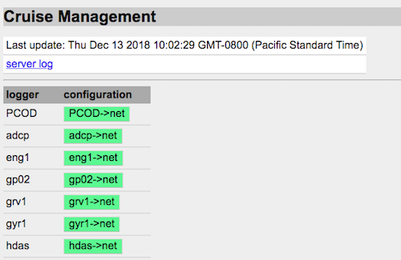
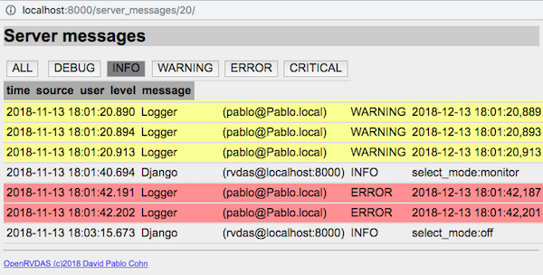

# OpenRVDAS Controlling Loggers
© 2018 David Pablo Cohn - DRAFT 2019-01-03

## Overview

The [OpenRVDAS Introduction and Overview](intro_and_overview.md) document provides an introduction to the OpenRVDAS framework, and [Introduction to Loggers](intro_to_loggers.md) provides an introduction to the process of running individual loggers.

This document describes two scripts that allow running, controlling and monitoring entire sets of loggers: [logger\_runner.py](../server/logger_runner.py) and [logger\_manager.py](../server/logger_manager.py).

## Table of Contents

* [logger\_runner.py](#logger--runnerpy)
* [logger\_manager.py](#logger--managerpy)
  + [Cruises, modes and configurations](#cruises--modes-and-configurations)
  + [What the logger manager does](#what-the-logger-manager-does)
  + [Running logger\_manager.py from the command line](#running-logger--managerpy-from-the-command-line)
  + [Managing loggers via a web interface](#managing-loggers-via-a-web-interface)

## logger\_runner.py

The [listen.py](listen_py.md) script is handy for running a single logger from the command line. For more sophisticated logger management, the [logger\_runner.py](../server/logger_runner.py) script is provided. It takes as its input a YAML or JSON file defining a dict of configurations that are to be run, where the keys are (convenient) configuration names, and the values are the logger configurations themselves.

```server/logger_runner.py --config test/config/sample_configs.yaml -v```

The sample_configs.yaml file should be a YAML-formatted dictionary:

```
eng1->net:
  name: eng1->net
  readers:
    class: SerialReader
    kwargs:
      baudrate: 9600
      port: /tmp/tty_eng1
  transforms:
  - class: TimestampTransform
  - class: PrefixTransform
    kwargs:
      prefix: eng1
  writers:
    class: NetworkWriter
    kwargs:
      network: ':6224'
gyr1->net:
  ...
knud->net:
  ...
s330->net:
  ...
```

where each logger configuration is in the format described in the
[Configuration Files](configuration_files.md) document.

Note that the provided test/config/sample_configs.yaml specifies
configurations that read simulated data from virtual serial ports. To
create those ports and begin feeding them with data, you'll need to
run

```
logger/utils/simulate_serial.py --config test/serial_sim.yaml --loop
```
in a separate terminal. To observe the data being logged by the above sample configs, you can start a Listener in yet another terminal:

```
logger/listener/listen.py --network :6224 --write_file -
```
Please see the [server/README.md](../server/README.md) file and [logger_runner.py](../server/logger_runner.py) headers for the most up-to-date information on running logger\_runner.py.

## logger\_manager.py

The logger\_runner.py script will run a set of loggers and retry them if they fail, but it doesn't provide any way of modifying their behaviors other than killing them all and re-running with a new set of configurations. The [logger\_manager.py](../server/logger_manager.py) script is a powerful wrapper around logger\_runner.py that offers much additional functionality.

### Cruises, modes and configurations

Before we dive into the use of logger\_manager.py, it's worth pausing for a moment to introduce some concepts that underlie the structure of the logger manager. _(Note: much of this section could be moved to [OpenRVDAS Configuration Files](configuration_files.md))._

-   **Logger configuration** - This is a definition for a set of Readers, Transforms and Writers feeding into each other, such as would be read using the --config argument of the listen.py script. In OpenRVDAS, each logger configuration that is active runs as its own daemon process.  The sample logger configuration below ("knud-\>net") reads NMEA data from the Knudsen serial port, timestamps and labels the record, then broadcasts it via UDP:

```
  knud->net: 
    host_id: knud.host
    name: knud->net
    readers: 
      class: SerialReader
      kwargs: 
        port: /tmp/tty_knud
        baudrate: 9600
    transforms: 
    - class: TimestampTransform
    - class: PrefixTransform
      kwargs: 
        prefix: knud
    writers: 
      class: NetworkWriter
      kwargs: 
        network: ":6224"
```
-   **Cruise mode (or just "mode")** - Logger configurations can be grouped into logical collections that will be active at any given time. Certain logger configurations will be running when a vessel is in port; another set may be running while the vessel is at sea, but within territorial waters; yet another when it is fully underway. The mode definition below indicates that when "port" mode is active, the configurations "gyr1-\>net", "mwx1-\>net", "s330-\>net" and "eng1-\>net" should be running:

```
  modes:  
    off:  
      gyr1: gyr1->off 
      mwx1: mwx1->off 
      s330: s330->off 
      eng1: eng1->off 
      knud: knud->off 
      rtmp: rtmp->off 
    port:  
      gyr1: gyr1->net 
      mwx1: mwx1->net 
      s330: s330->net 
      eng1: eng1->net 
      knud: knud->off 
      rtmp: rtmp->off 
    underway:
      gyr1: gyr1->file/net/db 
      mwx1: mwx1->file/net/db 
      s330: s330->file/net/db 
      eng1: eng1->file/net/db 
      knud: knud->file/net/db 
      rtmp: rtmp->file/net/db
```
-   **Cruise configuration** - (or just "configuration" when we're being sloppy). This is the file/JSON/YAML structure that contains everything the logger manager needs to know about running a cruise. In addition to containing cruise metadata (cruise id, provisional start and ending dates), a cruise configuration file (such as in [test/configs/sample\_cruise.yaml](../test/configs/sample\_cruise.yaml)), contains a dict of all the logger configurations that are to be run on a particular vessel deployment, along with definitions for all the modes into which those logger configurations are grouped.
  
It is worth noting that strictly speaking, a "logger" does not exist as a separate entity in OpenRVDAS. It is just a convenient way of thinking about a set of configurations that are responsible for a given data stream, e.g. Knudsen data, or a GPS feed. This is evident when looking at the [sample cruise definition file](../test/configs/sample\_cruise.yaml), as the logger definition ("knud") is just a list of the configurations that are responsible for handling the data that comes in from a particular serial port.

```
knud:
  configs:
  - knud->off,
  - knud->net,
  - knud->file/net/db
```
Perusing a complete cruise configuration file such as [test/configs/sample_cruise.yaml](../test/configs/sample_cruise.yaml) may be useful for newcomers to the system.

### What the logger manager does

In short, a bunch of stuff.


* It consults a database (either a transient in-memory one, or a Django-based one, depending on the value of the ```--database``` flag) to determine what loggers, logger configurations and cruise modes exist, and which cruise mode or combination of logger configurations the user wishes to have running. If a cruise configuration and/or mode are specified on startup via the ```--config``` and ```--mode``` flags, it stores those in the database as the new logger configuration definitions and desired cruise mode.

* It spawns a command line console interface (unless the ```--no-console``` flag is specified) that allows the user to load cruise configurations, change modes, set individual desired logger configurations and retrieve logger status reports.

* It starts/stops logger processes using the desired logger configurations specified by the database and records the new logger states in the database. Once started, it monitors the health of theses processes, recording failures in the database and restarting processes as necessary.

Additionally, if the ```--websocket :[port]``` flag has been specified, a running logger\_manager.py provides several services to clients that connect via the websocket:

* **Logger status updates** via connections to a websocket at ```hostname:port/logger_status```. This service may be used by web clients, such as the logger monitoring/control page provided by the Django GUI. (See the documentation for the [Django Web Interface](django_interface.md) for more information on this.)

    

* **Logger messages, warnings and errors** to clients that connect to ```hostname:port/messages/[log level]/[source]```, where log level and source are optional arguments.

    

* **Control of remote logger runner processes.** A cruise configuration file may specify that certain loggers may only run on certain machines (via a ```host_id``` field in the definition). This may be desirable if, for example, the required serial ports are only available on a particular machine. A remote host like this may connect to a logger manager via the invocation
      
    ```
    server/logger_runner.py --websocket <logger manager host>:<port> \
        --host_id knud.host
    ```
      
    to indicate that it is available to run logger configurations that are restricted to host ```knud.host```. The logger manager will dispatch any such logger configurations to this logger runner process.

    Note that this also provides a mechanism for manual load sharing if, for example, some logger processes are particularly compute intensive. Please see the header documentation in [server/logger\_runner.py](../server/logger_runner.py) for more details on how to use this functionality.

### Running logger\_manager.py from the command line

The logger\_manager.py script can be run with no arguments and will default to using an in-memory data store:

```
server/logger_manager.py
```
You can type "help" for a full list of commands, but a sample of the available functionality is

**Load a cruise configuration**

```
command? load_configuration test/nmea/NBP1406/NBP1406_cruise.yaml
command? 
```

**See what loggers are defined**

```
command? get_loggers
Loggers: PCOD, adcp, eng1, gp02, grv1, gyr1, hdas, knud, mbdp, mwx1, pco2, pguv, rtmp, s330, seap, svp1, true_winds, tsg1, tsg2
command?
```

**Get and change cruise modes**

```
command? get_modes
Available Modes: off, port, monitor, monitor and log
command? get_active_mode
Current mode: off
command? set_active_mode port
command? 
```

**Note**: the NBP1406 sample cruise directs UDP output to port 6224, so you can monitor the logger manager's network output by running the following listener command in a separate window to read from port 6224 and write to standard output:

```
    logger/listener/listen.py --network :6224 --write_file -
```

**Manually change logger configurations**

```
command? get_logger_configs gyr1
Configs for gyr1: gyr1->off, gyr1->net, gyr1->file/net/db
command? set_active_logger_config gyr1 gyr1->file/net/db
command? quit
```
As with sample script for logger\_runner.py, the sample cruise configuration file [test/nmea/NBP1406/NBP1406\_cruise.yaml](../test/nmea/NBP1406/NBP1406\_cruise.yaml) attempts to read from virtual serial ports, so you'll need to create those simulated serial ports by having the command

```
  logger/utils/simulate_serial.py \
      --config test/nmea/NBP1406/serial_sim_NBP1406.yaml \
      --loop
```

running in another terminal for the logger manager to load and run it without complaining.

### Other invocation options

If Django is installed and configured, you may also direct the logger manager to use the Django database when you invoke it. This has several advantages, the chief one being that desired logger states and modes will be preserved between runs of the logger manager (so that, for example, if the machine on which it is running is rebooted, the logger manager will restart the loggers that were running at the time.)

```
    server/logger_manager.py --database django
```

As described above, the logger manager may also be invoked with a websocket specification, which will allow communicating with it via the Django interface, and will enable the additional websocket-based services described above:

```
    server/logger_manager.py --database django \
        --websocket :8765
```

Finally, the logger manager may be invoked with a cruise configuration and/or cruise mode, and will attempt to load and run the loggers specified in it:

```
    server/logger_manager.py --config test/nmea/NBP1406/NBP1406_cruise.yaml \
        --mode monitor
```

Please see the [server/README.md](../server/README.md) file and [logger_manager.py](../server/logger_manager.py) headers for the most up-to-date information on running logger\_manager.py.

### Managing loggers via a web interface

There is a still-rudimentary Django-based GUI for controlling logger\_manager.py via a web interface. If you have installed OpenRVDAS using one of the utility installation scripts described in the appendix, they will have installed the NGINX web server and logger\_manager.py to run as system services. Please see the [Django Web Interface](django_interface.md) document and [django_gui/README.md](../django_gui/README.md) for up-to-date information.


