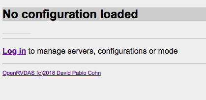
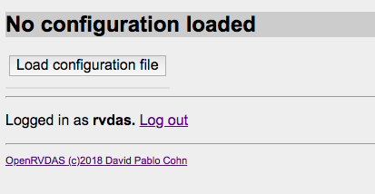
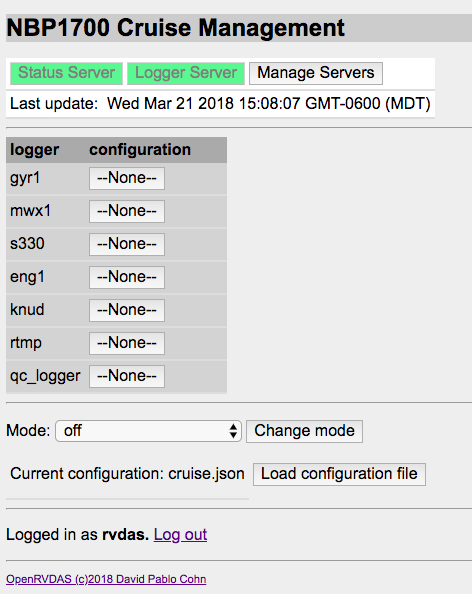
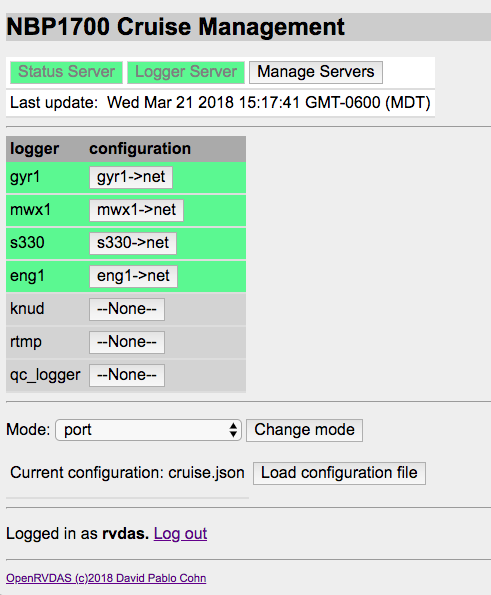
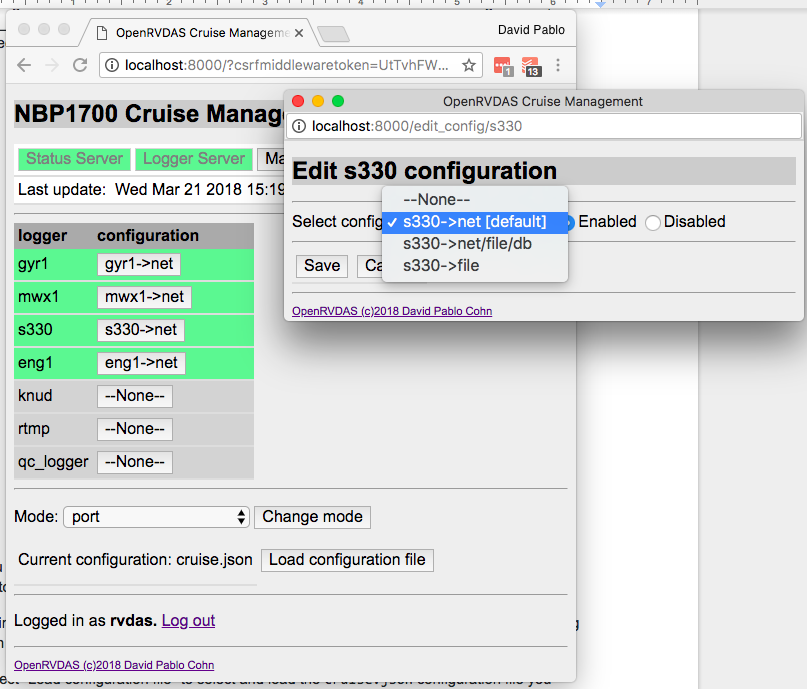
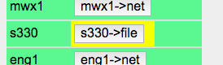

# OpenRVDAS Django Web Interface
© David Pablo Cohn - DRAFT 2019-10-04

## Table of Contents

* [Overview](#overview)
* [Installation](#installation-and-running)
* [Viewing Logger Output](#viewing-logger-output)
* [Display Pages](#display-pages)

## Overview

The object of the OpenRVDAS project is the construction of modular, extensible open source data acquisition systems, systems that support the capture, storage, processing and analysis of  data from a vessel's oceanographic, meteorological and other sensors. Please see  [OpenRVDAS Introduction to Loggers](intro_to_loggers.md) for a more complete introduction to the system as a whole.

While most of the system's core functionality can be accessed via individual command line scripts, a simple web-based graphical user interface is also available. This document describes that interface in its present form.

## Installation and Running

The code repository currently lives at [https://github.com/oceandatatools/openrvdas](https://github.com/oceandatatools/openrvdas), with installation instructions that can be found on the project's [INSTALL.md](../INSTALL.md) page. This document assumes that you have installed OpenRVDAS using one of the standard installation scripts described on that page.

If you have selected "yes" to run OpenRVDAS servers on start, then both the  ``logger_manager.py`` and ``cached_data_server.py`` should be running (you can check by running ``supervisorctl``).

At this point you can point your browser to

   [http://openrvdas](http://openrvdas)

assuming that is the name you gave the machine. You should see a page
indicating that no configuration has been loaded and prompting you to
log in.



Log in using the username (rvdas) and password that you specified; you
should now see a button that allows you to load a configuration.



Select the "Load configuration file" button and browse to find
[test/NBP1406/NBP1406_cruise.yaml](../test/NBP1406/NBP1406_cruise.yaml). Select
"Load", and you should be looking at a loaded and ready-to-run cruise
management page.



The default cruise mode in the sample cruise definition is "off". It
relies on data from simulated serial ports, so prior to running any of
its loggers, you'll need to set those up. You can manually run the
script that sets the ports up:

```
  python3 logger/utils/simulate_data.py \
    --config test/NBP1406/simulate_NBP1406.yaml
```

or use the pre-installed ``supervisor`` configuration to have
supervisord start and monitor the process for you. You can do this two
ways, either via the local webserver at
[http://openrvdas:9001](http://openrvdas:9001) (assuming your machine
is named 'openrvdas') or via the command line ``supervisorctl`` tool:

```
root@openrvdas:~# supervisorctl
cached_data_server               RUNNING   pid 5641, uptime 0:12:00
logger_manager                   RUNNING   pid 5646, uptime 0:11:59
simulate_nbp                     STOPPED   Oct 05 03:22 AM

supervisor> start simulate_nbp
simulate_nbp: started

supervisor> status
cached_data_server               RUNNING   pid 5641, uptime 0:12:13
logger_manager                   RUNNING   pid 5646, uptime 0:12:12
simulate_nbp                     RUNNING   pid 5817, uptime 0:00:05

supervisor> exit
```

To start some loggers running, select a different mode from the "Mode"
pulldown menu. The selection will turn yellow to highlight that the
selected mode differs from the actual mode. Now click "Change mode";
the logger\_manager.py you have running in a terminal window will
detect that a new mode has been selected and will start the logger
configurations appropriate for that mode.



You can also individually start, stop or modify the configuration of a logger by selecting the button indicating its current configuration.



When a configuration is selected that is different from the default configuration for the mode, the main page will highlight it in yellow:




## Viewing Logger Output

The sample cruise configuration defines loggers that output to one or
more of 1) logfile 2) network, and 3) database.  If a logger
configuration is specified that writes to a file, you can monitor the
file output with

```
tail -f /var//tmp/log/s330/raw/*
```

or examine the specific subdirectories of /var/tmp/log to perform a
"tail -f" on one specific file (note that the directory path for log
files is one of the things specified in cruise.yaml).

Loggers that are writing to the local network may be monitored using the listener script:

```
python3 logger/listener/listen.py --udp 6224
```

Similarly, loggers that are writing to the database may be monitored using the listen.py script invoked with a database readers:

```
 python3 logger/listener/listen.py \
    --database_password rvdas \
    --database rvdas@localhost:data
```
