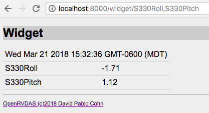

# OpenRVDAS Django Web Interface
© David Pablo Cohn - david.cohn@gmail.com  
DRAFT 2018-08-10

## Table of Contents

* [Overview](#overview)
* [Installation](#installation-and-running)
* [Viewing Logger Output](#viewing-logger-output)
* [Widgets](#widgets)

## Overview

The object of the OpenRVDAS project is the construction of modular, extensible open source data acquisition systems, systems that support the capture, storage, processing and analysis of  data from a vessel's oceanographic, meteorological and other sensors. Please see  [OpenRVDAS Introduction to Loggers](intro_to_loggers.md) for a more complete introduction to the system as a whole.

While most of the system's core functionality can be accessed via individual command line scripts, a simple web-based graphical user interface is also available. This document describes that interface in its present form.

## Installation and Running

The code repository currently lives at [https://github.com/davidpablocohn/openrvdas](https://github.com/davidpablocohn/openrvdas), with installation instructions that can be found on the project's [INSTALL.md](../INSTALL.md) page. Note that to use the web-based interface, you will need to not only install the core code described in INSTALL.md, but also follow the installation instructions for two sub directories:

* database configuration, in [database/README.md](../database/README.md)
* GUI configuration, in [django_gui/README.md](../django_gui/README.md)

We refer you to those pages for installation rather than risk version skew by reproducing instructions here that may become obsolete as the code changes.
Running

This section describes running the GUI using the simplified Django test server and the default SQLite database. Actual deployments will likely require more robust services, such as Apache and MySQL or MariaDB.

NOTE: if you have installed the system using one of the scripts in openrvdas/utils, steps 1-3 have already been done for you. An NGINX web server will be running on port 80, so you will need to modify the directions that refer to the test server and port 8000 accordingly.

Set up the default Django database models (uses SQLite, as configured in django_gui/settings.py):

```
python3 manage.py makemigrations gui
python3 manage.py migrate
python3 manage.py createsuperuser --email rvdas@somerandom.com \
   --username rvdas
```

Start the test server

```
python3 manage.py runserver localhost:8000
```
In a separate window, run logger_manager.py

```
python3 server/logger_manager.py \
    --database django \
    --data_server_websocket :8765 \
    --data_server_udp :6225 \
    --start_data_server
```
This tells the LoggerManager to run a CachedDataServer that listens for 
UDP broadcasts of data from loggers on port 6225 and accepts websocket
connections on port 8765.

The sample configuration relies on simulated serial ports serving data
stored in the test/ directory. To set up the simulated ports, run

```
python3 logger/utils/simulate_serial.py \
  --config test/nmea/NBP1406/serial_sim_NBP1406.yaml --loop
```

At this point you should be able to open a browser window to 

[http://localhost:8000](http://localhost:8000)

and see a page indicating that no configuration has been loaded and prompting you to log in.


Log in using the username (rvdas) and password that you specified; you should now see a button that allows you to load a configuration.


Select the "Load configuration file" button and browse to find [test/nmea/NBP1406/NBP1406_cruise.yaml](../test/nmea/NBP1406/NBP1406_cruise.yaml). Select "Load", and you should be looking at a loaded and ready-to-run cruise management page.


The default cruise mode in the sample cruise definition is "off". To start some loggers running, select a different mode from the "Mode" pulldown menu. The selection will turn yellow to highlight that the selected mode differs from the actual mode. Now click "Change mode"; the logger_manager.py you have running in a terminal window will detect that a new mode has been selected and will start the logger configurations appropriate for that mode.


You can also individually start, stop or modify the configuration of a logger by selecting the button indicating its current configuration.


When a configuration is selected that is different from the default configuration for the mode, the main page will highlight it in yellow:


## Viewing Logger Output

The sample cruise configuration defines loggers that output to one or more of 1) logfile 2) network, and 3) database.
If a logger configuration is specified that writes to a file, you can monitor the file output with

```
tail -f /tmp/log/NBP1700/*/*/*
```
or examine the specific subdirectories of /tmp/log to perform a "tail -f" on one specific file (note that the directory path for log files is one of the things specified in cruise.yaml).

Loggers that are writing to the local network may be monitored using the listener script:

```
python3 logger/listener/listen.py \
    --network :6224 --write_file -
```
Similarly, loggers that are writing to the database may be monitored using the listen.py script invoked with a database readers:

```
 python3 logger/listener/listen.py \
    --database_password rvdas \
    --database rvdas@localhost:data \
    --write_file -
```

## Widgets

A very rudimentary display widget has been implemented in

```
http://localhost:8000/widget
```
The user can specify the desired fields to display as a comma-separated list on the command line. For example, the link

[http://localhost:8000/widget/S330Roll,S330Pitch](http://localhost:8000/widget/S330Roll,S330Pitch)

will instantiate a widget that tries to establish a websocket connection with the logger manager and requests updates for the specified fields.



In the current implementation, the updates are drawn from records written to the database, so only fields that are currently being written to the database will be updated in the widget. (In the above example, select and enable the s330->net/file/db configuration to ensure that the widget updates.)
