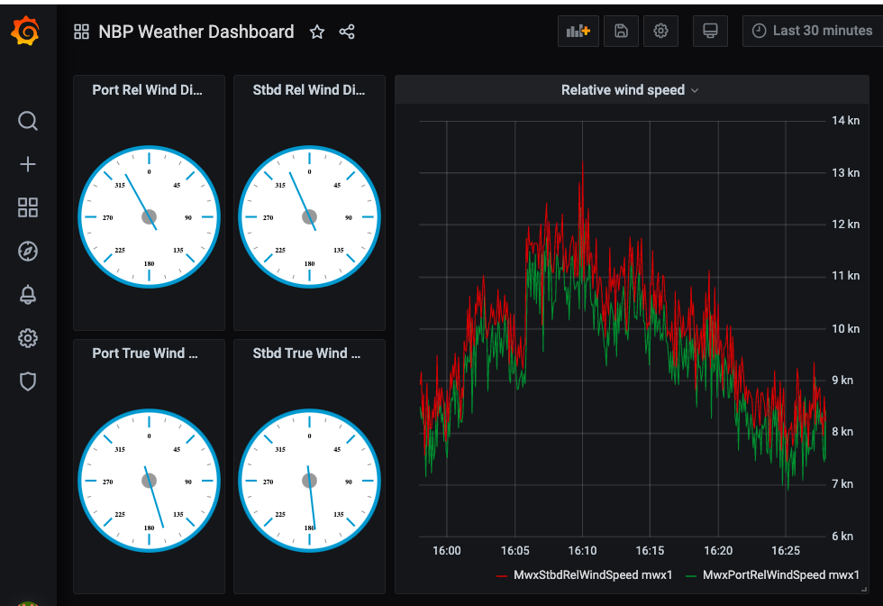

# Grafana/InfluxDB-based Displays with OpenRVDAS
© 2020 David Pablo Cohn - DRAFT 2020-12-01

## Table of Contents

* [Overview](#overview)
* [Installation](#installation)
* [Running](#running)
* [Configuing Grafana](#configuring-grafana)
* [Writing data to InfluxDB](#writing-data-to-influxdb)
* [Creating Grafana Dashboards](#creating-grafana-dashboards)

## Overview

InfluxDB is a widely-used open source time series database. Grafana is
an open source visualization package. Used together, the two allow
drag-and-drop creation of sophisticated data displays that meet and
exceed the power of OpenRVDAS display tools. We strongly encourage
OpenRVDAS users to focus their efforts toward creating data displays
on the use of Grafana and InfluxDB. Telegraf is an additional package
that can collect system variables such as disk and memory usage and
feed them to InfluxDB. This document describes how to install and
configure InfluxDB, Grafana and Telegraf, how to create cruise
definitions that feed data into them, and the rudiments of how to
create displays that make use of the resulting data.

These instructions describe the process for InfluxDB 2.0, Grafana 7.1
and Telegraf 1.15.

## Installation

There is now an installation script ``utils/install_influxdb.sh`` that
will walk you through the installation and configuration of InfluxDB,
Grafana and Telegraf.

If you are upgrading an existing installation and had already installed
InfluxDB, you will need to disable the old invocation of InfluxDB. You can
do this either by re-running the main installation script, or manually
editing the OpenRVDAS supervisor file, which is in either `/etc/supervisord.d/openrvdas.ini`,
`/usr/local/etc/supervisor.d/openrvdas.ini`, or `/etc/supervisor/conf.d/openrvdas.conf`
depending on operating system.

There is one more hitch if installing with MacOS Catalina, due to its
reluctance to run unfamiliar packages. If you are running under
Catalina, the system will balk when the script first tries to run
``influx`` and ``influxd``. If that happens:

1. Attempt to run /usr/local/bin/influxd from a terminal window.
2. If it balks, open System Preferences and click "Security & Privacy."
3. Under the General tab, there is a message about influxd being
   blocked. Click Open Anyway.
4. Repeat this with /usr/local/bin/influx

Then re-run the installation script, and it should pick up where it
left off.

## Running

You shouldn't need to, but after the installation script has
completed, you can run InfluxDB, Grafana and Telegraf from the command
line:

```
/usr/local/bin/influxd --reporting-disabled

/usr/local/bin/grafana-server --homepath /usr/local/etc/grafana

/usr/local/bin/telegraf --config=/usr/local/etc/telegraf/etc/telegraf/telegraf.conf
```

Instead of doing this, you should start/stop them using `supervisord`.

In addition to putting links to the relevant binaries in
/usr/local/bin, the script also creates a config file that can be read
by `supervisord` instructing it how to run each of the programs. The
location of this script depends on the system - MacOS, CentOS and
Ubuntu all hide their supervisord config files in different places.

```
MacOS    - /usr/local/etc/supervisor.d/influx.ini
CentOS   - /etc/supervisord.d/influx.ini
Ubuntu   - /etc/supervisor/conf.d/influx.conf
```

You will need to tell supervisor to reload its configuration files to
have this new file read in the first time:

```
> supervisorctl reload
```

After this, you should be able to see the new scripts in the
supervisorctl pages:

```
> supervisorctl status
influx:grafana                   STOPPED   Sep 13 10:32 PM
influx:influxdb                  STOPPED   Sep 13 10:32 PM
influx:telegraf                  STOPPED   Sep 13 10:32 PM
openrvdas:cached_data_server     RUNNING   pid 28136, uptime 2:59:52
openrvdas:logger_manager         RUNNING   pid 28137, uptime 2:59:52
simulate:simulate_nbp            RUNNING   pid 28164, uptime 2:59:37
web:nginx                        RUNNING   pid 28134, uptime 2:59:52
web:uwsgi                        RUNNING   pid 28135, uptime 2:59:52
>
```

If you specified "Run on boot" when you ran the installation script,
the influx-related scripts should all start running now, and whenever
you reboot the machine or restart supervisord.

To manually start all the scripts, run

```
> supervisorctl start influx:*
influx:telegraf: started
influx:influxdb: started
influx:grafana: started
>
```

If anything is going wrong with one of the scripts run by
`supervisord`, you can examine its stderr in
`/var/log/openrvdas/[influxdb,grafana,telegraf].stderr`.

## Configuring Grafana

Once the packages are loaded and running, you will need to connect Grafana to InfluxDB.

* Point a browser window ``<machine name>:8086``; log into InfluxDB using
  the username and password you set in the previous step.

* Select the "Load Data" menu on the far left (shaped like an
  old-fashioned disc stack); select "Tokens", then select the
  highlighted-in-blue "<username>'s Token" and "Copy to Clipboard"

* Point your browser to the Grafana server you started at ``<machine
  name>:3000``. You will be prompted to log in. The initial username
  will be admin, password will be: admin. You will be prompted to
  change it. You can change passwords and invite/add more users by
  selecting the gear (settings) icon in the left panel.

* Select the "gear" icon on the far left menu, then "Data sources" and
  "Add data source". Select “Flux (InfluxDB) [BETA]”. Set

  * Default data source as true
  * URL: ``http://machine name>:8086`` # machine where InfluxDB is running
  * Organization: openrvdas
  * Token: Paste this in from your browser clipboard

* Select "Save & Test"

NOTE: If you reinstall InfluxDB, e.g. by re-running the OpenRVDAS
installation script, the InfluxDB AUTH_TOKEN will change, and you will
need to supply the new one to Grafana and Telegraf.

## Writing data to InfluxDB

To write to InfluxDB, OpenRVAS needs to have the AUTH_TOKEN of an
authorized InfluxDB user. If all went well, the installation script
copied that into ``database/settings.py`` automatically. You can
verify this by looking at the end of ``database/settings.py`` for
something like:

```
################################################################################
# InfluxDB settings
INFLUXDB_URL = 'http://localhost:8086'
INFLUXDB_ORG = 'openrvdas'
INFLUXDB_AUTH_TOKEN = '4_e-eyx0h8i0UzVkC5jlRy6s4LQM8UXgJAE5xT2a7izbH2_PwyxKY--lQ7FTGvKj5rh9vg04MeksHUL017SNwQ=='  # your InfluxDB token here
```

Assuming there is a URL, ORG and AUTH_TOKEN set, you should be able to
specify an InfluxDBWriter in your logger configurations, and the data
will get to where it needs to go. Much like a CachedDataWriter, the
InfluxDBWriter expects either a DASRecord or a dict containing
'timestamp' and 'fields' dicts:

```
  gyr1->net:
    name: gyr1->net
    readers:                    # Read from serial port
      class: SerialReader
      kwargs:
        baudrate: 4800
        port: /tmp/tty_gyr1
    transforms:                 # Add timestamp and logger label
    - class: TimestampTransform
    - class: PrefixTransform
      kwargs:
        prefix: gyr1
    - class: ParseTransform     # Parse into a DASRecord
      kwargs:
        metadata_interval: 10
        definition_path: local/usap/nbp/devices/nbp_devices.yaml
    writers:
    - class: CachedDataWriter   # Send to Cached Data Server
      kwargs:
        data_server: localhost:8766
    - class: InfluxDBWriter     # Send to InfluxDB
      kwargs:
        bucket_name: openrvdas
        measurement_name: gyr1
```

NOTE: If the InfluxDBWriter is unable to connect to InfluxDB, it is
possible that your AUTH_TOKEN has been updated. If so, you'll need to
manually look it up (see the initial steps in [Configuring
Grafana](#configuring-grafana)), and copy it into the appropriate
place in ``database/settings.py``. You may also need to copy the new
token back into Grafana, as described in rest of the steps of that
section.

## Creating Grafana Dashboards

* To start a new dashboard, select the “+” at the left menu, then
  select “Dashboards.” Select the “Add new panel” button (widgets are
  called “panels” here).

* You’ll be able to select a “Visualization” to choose between graphs,
  numerical stats, dials, etc. 360 degree dials are created using a
  “D3 Gauge” which was the “briangann-gauge-panel” the installation
  script loaded from Grafana labs.

* To get the data into the visualization, you’ll need to create a
  query in the Flux query language. I haven’t attempted to learn
  it. Instead, I generate the query using the InfluxDB server:

  * Open a browser on the machine serving InfluxDB, e.g
    http://nbp-odas-t:8086

  * Select “Data Explorer (the zigzag) from the left panel. This will
    show you what fields are available. Select the sensors and field
    names you want, along with any modifications (mean, median, skew,
    etc). You can also select graph type (above to left) but that
    won’t affect the data query.

  * Hit “Submit” (over on right) to check that you’ve got the data you
    want. Don’t forget to set the refresh rate and window size so that
    you can confirm you’re getting real data.

  * Once you’ve got the data you want showing up in the Data Explorer,
    select “Script Editor” (next to the “Submit” button”), and you’ll
    be shown the Flux query used to retrieve the data. Copy that and
    paste it into the query box in your Grafana panel editor (bottom,
    to the left, under “A”).

* Hit “Save” and “Apply”

* Panels may be dragged around and resized. Don’t forget to hit “Save”
  (the floppy icon) prior to leaving your dashboard page.


