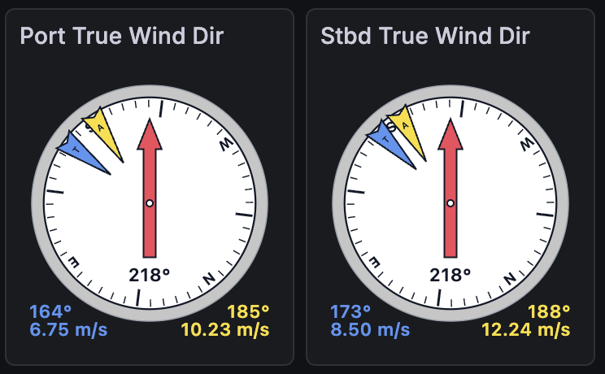
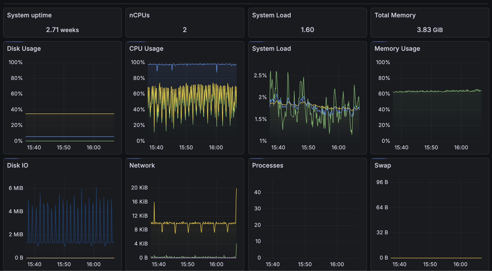

# Grafana/InfluxDB-based Displays with OpenRVDAS
© 2025 David Pablo Cohn

InfluxDB is a widely-used open source time series database. Grafana is an open source visualization package. Used together, the two allow drag-and-drop creation of sophisticated data displays that meet and exceed the power of OpenRVDAS display tools. We strongly encourage OpenRVDAS users to focus their efforts toward creating data displays on the use of Grafana and InfluxDB. Telegraf is an additional package that can collect system variables such as disk and memory usage and feed them to InfluxDB.

> **Important**: The legacy `utils/install_influxdb.sh` script has been deprecated. Constant changes to InfluxDB and Grafana versions have made automated installation difficult to maintain. We now recommend that users refer directly to the latest installation instructions for each package.

This document provides guidance on how to find those instructions, and how to configure OpenRVDAS to work with the installed packages.

---

## Quick Start

For experienced users:
1. Install InfluxDB, Grafana, and optionally Telegraf using official documentation
2. Create an InfluxDB organization, bucket, and authentication token
3. Configure Grafana data source pointing to InfluxDB
4. Configure OpenRVDAS `InfluxDBWriter` with your credentials
5. Create dashboards in Grafana

Detailed instructions for each step follow below.

---

## InfluxDB

The latest package can be retrieved at <https://www.influxdata.com/products/influxdb/>; follow the installation guide appropriate for your platform (Linux, macOS, Windows, Docker, or cloud) and verify that the InfluxDB service is running before continuing.

### Installation

Follow the official InfluxDB installation instructions for your platform. Once installed, the InfluxDB web interface is typically available at <http://localhost:8086>.

### Initial Setup and Authentication

Once InfluxDB is installed and running, you must configure authentication for external applications to write data.

If this is a new installation, complete the initial setup process (via the web UI or CLI) to create:
- An organization (typically `openrvdas`)
- A bucket (again, typically `openrvdas`)
- An initial admin user (typically the user defined in the OpenRVDAS installation)

During this setup, InfluxDB will generate one or more authentication tokens.

### Creating an Authentication Token

If you need to create a new authentication token:

1. Open the InfluxDB web interface at <http://localhost:8086>
2. Log in with your admin credentials
3. Navigate to **Load Data → API Tokens** (or **Settings → Tokens** depending on version)
4. Click **Create Token** and select the appropriate permissions (e.g., write access to the target bucket)
5. **Important**: Copy and save the token immediately—it will only be displayed once

If you lose your token, you will need to generate a new one to give external systems like OpenRVDAS or Grafana access to InfluxDB.

### Configuring OpenRVDAS to Write to InfluxDB

OpenRVDAS interacts with InfluxDB primarily through the [`InfluxDBWriter`](https://github.com/OceanDataTools/openrvdas/blob/master/logger/writers/influxdb_writer.py). You have two options for providing credentials:

#### Option 1: Pass credentials directly

```python
writer = InfluxDBWriter(
    org='openrvdas',
    bucket_name='openrvdas',
    auth_token='8oyxASrMAqb6EzVfxSBvh....',
    url='http://localhost:8086'
)
```

#### Option 2: Use a settings file (recommended)

1. Copy `database/influxdb/settings.py.template` to `database/influxdb/settings.py`
2. Edit the file with your values:

```python
# InfluxDB settings
INFLUXDB_URL = 'http://localhost:8086'
INFLUXDB_ORG = 'openrvdas'
INFLUXDB_BUCKET = 'openrvdas'
INFLUXDB_AUTH_TOKEN = '8oyxASrMAqb6EzVfxSBvh1iI...'
```

The `InfluxDBWriter` will automatically read these values from the settings file.

#### Using InfluxDBWriter in Logger Configurations

The `InfluxDBWriter` expects either a DASRecord or a dict containing 'timestamp' and 'fields' dicts:

```yaml
gyr1->net:
  name: gyr1->net
  readers:                    # Read from serial port
    class: SerialReader
    kwargs:
      baudrate: 4800
      port: /tmp/tty_gyr1
  transforms:                 # Add timestamp and logger label
  - class: TimestampTransform
  - class: PrefixTransform
    kwargs:
      prefix: gyr1
  - class: ParseTransform     # Parse into a DASRecord
    kwargs:
      metadata_interval: 10
      definition_path: local/usap/nbp/devices/nbp_devices.yaml
  writers:
  - class: CachedDataWriter   # Send to Cached Data Server
    kwargs:
      data_server: localhost:8766
  - class: InfluxDBWriter     # Send to InfluxDB
    kwargs:
      bucket_name: openrvdas
      measurement_name: gyr1
```

---

## Grafana

Grafana is an open source visualization and dashboarding system that can read data from a wide variety of sources, including InfluxDB. When used together, Grafana provides a powerful, flexible, and actively maintained replacement for legacy OpenRVDAS display tools.

### Installation

Grafana installation procedures vary by operating system and deployment method. Please install Grafana by following the official instructions provided by Grafana Labs: <https://grafana.com/grafana/download>.

Choose the installation method appropriate for your platform (Linux packages, macOS, Windows, Docker, or cloud) and verify that the Grafana service is running before continuing.

Once installed, the Grafana web interface is typically available at <http://localhost:3000>.

Log in using the credentials created during installation (or the default credentials, if applicable), and complete any initial setup steps required by your installation.

---

### Configuring Grafana to Access InfluxDB

After Grafana is running, you must configure it with a **data source** pointing to your InfluxDB instance.

1. Open the Grafana web interface
2. Navigate to **Configuration → Data sources** (or **Connections → Data sources**, depending on version)
3. Click **Add data source**
4. Select **InfluxDB** from the list of available data sources

You will then be prompted to enter connection details for your InfluxDB installation.

Typical settings include:

- **Query language**: Flux (for InfluxDB 2.x and later)
- **URL**: <http://localhost:8086>
- **Organization**: openrvdas (or as you specified in InfluxDB)
- **Bucket**: openrvdas (or as you specified in InfluxDB)
- **Authentication**: Use an API token
- **Token**: Paste the InfluxDB authentication token created during the InfluxDB setup

After entering these values, click **Save & Test** to verify that Grafana can connect to InfluxDB.

---

### Authentication Token Notes

Grafana uses the same InfluxDB API tokens described in the InfluxDB section above. The token must have at least **read access** to the bucket being visualized.

As with all API tokens:
- Store them securely
- Do not commit them to version control
- Limit permissions to the minimum required

---

### Working with Flux Queries

Flux is InfluxDB's query language. While you can write queries manually, we recommend generating them using InfluxDB's Data Explorer interface, then copying them into Grafana.

#### Generating Flux Queries with Data Explorer

1. Open the InfluxDB web interface (e.g., <http://localhost:8086>)
2. Select **Data Explorer** (the zigzag icon) from the left panel
3. Select the sensors and field names you want, along with any modifications (mean, median, etc.)
4. Set the time range and refresh rate
5. Click **Submit** to verify you're getting the data you expect
6. Click **Script Editor** (next to the Submit button) to see the Flux query
7. Copy the query and paste it into the query box in your Grafana panel editor

#### Sample Flux Query

The following is a simple example of a Flux query that can be used in Grafana to retrieve recent OpenRVDAS data from InfluxDB:

```flux
from(bucket: "openrvdas")
|> range(start: -15m)
|> filter(fn: (r) => r._measurement == "s330")
|> filter(fn: (r) => r._field == "S330HeadingTrue")
|> aggregateWindow(every: 10s, fn: mean, createEmpty: false)
|> yield(name: "mean")
```

This query:
- Reads data from the openrvdas bucket
- Selects data from the last 15 minutes
- Filters on a specific measurement and field
- Aggregates values into 10-second averages

You can adapt the measurement name, fields, time range, and aggregation function to suit your OpenRVDAS configuration and display requirements.

---

### Creating Grafana Dashboards

Once the InfluxDB data source is configured, Grafana can be used to create dashboards and panels that visualize OpenRVDAS data stored in InfluxDB.

#### Creating a New Dashboard

1. Select the **+** icon in the left menu, then select **Dashboard**
2. Click **Add new panel** (widgets are called "panels" in Grafana)
3. Select a **Visualization** type (graph, stat, gauge, etc.)
4. In the query editor at the bottom, paste your Flux query (generated using Data Explorer as described above)
5. Configure visualization settings as needed
6. Click **Apply** to add the panel to your dashboard
7. Panels can be dragged around and resized as needed
8. Don't forget to click **Save** (the floppy disk icon) to save your dashboard

Dashboards can be created interactively using Grafana's web interface and shared or exported as needed.

Refer to the Grafana documentation for details on dashboard creation, panel types, and query syntax.


---

### Grafana Plugins and Dashboards

Grafana ships with a comprehensive set of built-in plugins that are sufficient for most OpenRVDAS visualization needs. In general, **no additional Grafana plugins are required** to work with OpenRVDAS and InfluxDB.

#### Built-in Plugins

The standard Grafana installation includes core panel types and data sources such as:

- Time series
- Table
- Stat
- Gauge / Bar gauge
- Heatmap
- State timeline
- Text
- InfluxDB data source

These built-in plugins are actively maintained as part of Grafana and require no separate installation.

---

#### Optional Plugins

In some cases, additional plugins may be useful, though they are not required. Examples include:

- **Geomap panel** - Useful for displaying position or track data (latitude/longitude) stored in InfluxDB

- **Plotly panel** - Allows advanced plotting and interactive visualizations

- **Discrete panel (legacy)** - Useful for categorical or state-based data (note that newer Grafana versions provide built-in alternatives such as State timeline)

Optional plugins can be installed using Grafana's plugin manager or command-line tools. Refer to the Grafana documentation for plugin installation instructions.

One particularly useful panel that can be added is the [**Ocean Data Tools Compass Panel**](https://github.com/OceanDataTools/grafana-compass-panel). Please visit <https://github.com/OceanDataTools/grafana-compass-panel> for instructions on how to install and configure it for your system.



> Note: Plugin availability and compatibility may vary between Grafana versions.

---

### Importing and Exporting Dashboards

Grafana dashboards can be easily shared and reused.

#### Exporting a Dashboard

1. Open the dashboard in Grafana
2. Click **Dashboard settings → JSON model**
3. Copy or download the dashboard JSON

This JSON file can be stored in version control or shared with other users.

#### Importing a Dashboard

1. Navigate to **Dashboards → Import**
2. Paste the dashboard JSON or upload the JSON file
3. Select the appropriate InfluxDB data source when prompted
4. Complete the import

This allows dashboards to be reused across systems with minimal changes.

Several pre-built dashboards that can be adapted for use by other installations are available in the [OpenRVDAS sample USAP installation directory](https://github.com/OceanDataTools/openrvdas_usap/tree/main/nbp/dashboards).

---

### Notes

- Dashboards created for OpenRVDAS typically rely only on standard Grafana panels and the InfluxDB data source
- When importing dashboards, ensure that measurement names, fields, and bucket names match your InfluxDB configuration
- Grafana plugins and dashboards are independent of OpenRVDAS and can be added or removed without affecting data collection

---

## Telegraf (Optional)

Telegraf is an open source agent for collecting system and application metrics and writing them to time series databases such as InfluxDB. When used with OpenRVDAS, Telegraf can be configured to collect system-level metrics (for example CPU usage, memory usage, disk activity, and network statistics) and store them alongside OpenRVDAS data in InfluxDB for visualization in Grafana.

---

### Installation

Telegraf installation procedures vary by operating system and deployment method. Please install Telegraf by following the official instructions provided by InfluxData: <https://www.influxdata.com/time-series-platform/telegraf/>.

Choose the installation method appropriate for your platform (Linux packages, macOS, Windows, Docker, or cloud) and verify that the Telegraf service is installed before continuing.

---

### Configuring Telegraf to Write to InfluxDB

Once Telegraf is installed, it must be configured to write collected metrics to your InfluxDB instance.

Telegraf configuration is typically stored in a file named `telegraf.conf` (the exact location depends on your platform). Edit this file and configure the InfluxDB output plugin to match your InfluxDB setup.

For InfluxDB 2.x and later, configure the `influxdb_v2` output plugin. A minimal example is shown below:

```toml
[[outputs.influxdb_v2]]
  urls = ["http://localhost:8086"]
  token = "8oyxASrMAqb6EzVfxSBvh1iI..."
  organization = "openrvdas"
  bucket = "system_health"
```

The authentication token must have write access to the specified bucket.

---

### Enabling Input Plugins

Telegraf collects data through input plugins. Common system-level input plugins include:
- cpu
- mem
- disk
- diskio
- net
- system

These are often enabled by default. You may adjust their settings in `telegraf.conf` as needed for your environment. For example:

```toml
[[inputs.cpu]]
  percpu = true
  totalcpu = true
  collect_cpu_time = false
  report_active = true

[[inputs.mem]]

[[inputs.disk]]
  ignore_fs = ["tmpfs", "devtmpfs"]

[[inputs.net]]
```

Refer to the Telegraf documentation for a full list of available plugins and configuration options.

---

### Starting and Verifying Telegraf

After configuring Telegraf, start (or restart) the Telegraf service according to your platform's conventions (for example, using systemctl, service, or a container runtime).

Once running, verify that:
- Telegraf is active and not reporting errors
- Metrics are appearing in the specified InfluxDB bucket

You can confirm data ingestion by:
- Viewing logs from the Telegraf service
- Using the InfluxDB web UI to browse recent data
- Querying the data from Grafana

---

### Notes

- Telegraf is optional and not required for OpenRVDAS operation
- Telegraf metrics can be visualized in Grafana using the same InfluxDB data source configured earlier
- As with all authentication tokens, store the InfluxDB token securely and limit permissions to only what is required



---

## Managing InfluxDB, Grafana, and Telegraf Services

InfluxDB, Grafana, and Telegraf are long-running services and must be managed so that they start automatically, restart on failure, and shut down cleanly. How this is done depends on how the software was installed and the conventions of your operating system.

Common approaches include:

- Native service managers (e.g., `systemd` on Linux, `launchd` on macOS)
- Container orchestration (e.g., Docker, Docker Compose)
- Process supervisors such as `supervisord`

Any of these approaches are valid, provided the services are kept running reliably.

---

### Example: Managing Services with Supervisor

One way to manage InfluxDB, Grafana, and Telegraf is to use **Supervisor**, in the same way OpenRVDAS services are often managed.

When using Supervisor, a configuration file can be created in the appropriate directory (for example, `/etc/supervisor/conf.d/`) that defines how each service should be started and monitored.

The following example parallels the `openrvdas.conf` files typically found in the same directory and reflects the configuration generated by the legacy `utils/install_influxdb.sh` script:

```ini
; Control file for InfluxDB, Grafana and Telegraf. Generated using the
; openrvdas/utils/install_influxdb.sh script

; Run InfluxDB
[program:influxdb]
command=/usr/bin/influxd --reporting-disabled
directory=/opt/openrvdas
;environment=INFLUXD_CONFIG_PATH=/etc/influxdb
autostart=true
autorestart=true
startretries=3
stderr_logfile=/var/log/openrvdas/influxdb.stderr
user=rvdas

; Run Grafana
[program:grafana]
command=/usr/sbin/grafana-server --homepath /usr/share/grafana
directory=/usr/share/grafana
autostart=true
autorestart=true
startretries=3
stderr_logfile=/var/log/openrvdas/grafana.stderr
;user=rvdas

; Run Telegraf
[program:telegraf]
command=/usr/bin/telegraf --config=/etc/telegraf/telegraf.d/openrvdas.conf
directory=/opt/openrvdas
autostart=true
autorestart=true
startretries=3
stderr_logfile=/var/log/openrvdas/telegraf.stderr
user=rvdas

[group:influx]
programs=influxdb,grafana,telegraf
```

After creating this configuration file, reload the Supervisor configuration:

```bash
supervisorctl reload
```

You can then manage the services using Supervisor:

```bash
# Check status
supervisorctl status

# Start all services
supervisorctl start influx:*

# Stop all services
supervisorctl stop influx:*

# Restart a specific service
supervisorctl restart influx:grafana
```

If anything is going wrong with one of the services run by Supervisor, you can examine its stderr log in `/var/log/openrvdas/[influxdb,grafana,telegraf].stderr`.

---

## Troubleshooting

### InfluxDBWriter Cannot Connect

If the `InfluxDBWriter` is unable to connect to InfluxDB:

- **Verify InfluxDB is running**: Check that the InfluxDB service is active
- **Check your authentication token**: Your token may have been updated or regenerated. To verify:
  1. Open the InfluxDB web interface at <http://localhost:8086>
  2. Navigate to **Load Data → API Tokens**
  3. Copy the correct token and update it in `database/influxdb/settings.py`
- **Verify network connectivity**: If InfluxDB is on a different host, ensure network access is available
- **Check logs**: Examine `/var/log/openrvdas/` for error messages

### Grafana Shows "No Data"

If your Grafana panels show no data:

- **Verify the data source connection**: Go to **Configuration → Data sources** and click **Save & Test** on your InfluxDB data source
- **Check your authentication token**: The token in Grafana may be outdated. Update it with the current token from InfluxDB
- **Verify data is being written**: Use the InfluxDB Data Explorer to confirm data is arriving in your bucket
- **Check your query**: Ensure measurement names and field names in your Flux query match what's in InfluxDB
- **Check the time range**: Ensure the dashboard time range covers a period when data was actually collected

### Authentication Token Has Changed

If you reinstall InfluxDB or regenerate tokens:

1. Retrieve the new token from InfluxDB (**Load Data → API Tokens**)
2. Update `database/influxdb/settings.py` with the new token
3. Update the token in Grafana (**Configuration → Data sources → InfluxDB**)
4. Restart any OpenRVDAS loggers using the `InfluxDBWriter`
