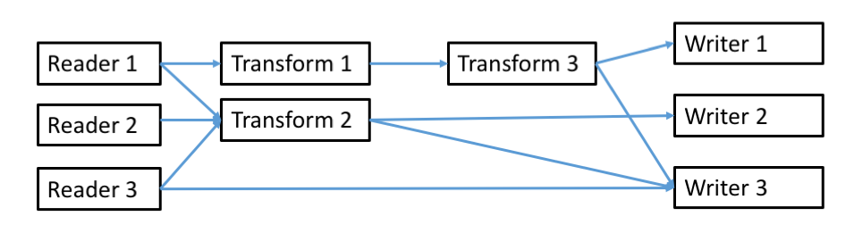

# OpenRVDAS Introduction and Overview
© 2018 David Pablo Cohn - DRAFT 2018-12-15

## Table of Contents

- [Overview - needs and design philosophy](#overview---needs-and-design-philosophy)
  * [Design Philosophy](#design-philosophy)
- [Architecture](#architecture)
  * [Running Loggers](#running-loggers)
  * [Controlling Multiple Loggers](#controlling-multiple-loggers)
  * [Controlling Multiple Loggers via Web Interface](#controlling-multiple-loggers-via-web-interface)
  * [Displaying Logger Data](#displaying-logger-data)
- [Roadmap](#roadmap)
- [More Documentation](#more-documentation)

## Overview - needs and design philosophy

One of the primary values a research vessel offers is the ability to gather accurate and timely scientific data wherever it travels. Most ships carry some combination of oceanographic, meteorological and other sensors and operate a system for storing, processing, analyzing and displaying the data they produce.

At present there are limited options for a ship wishing to operate such a system, and most either rely on a closed-source Windows-based solution (SCS) or on custom-crafted versions of software dating from the 1990's (dsLog, LDS). This limited choice means that expertise is wasted in maintaining fragmented code, or stifled while waiting for a monolithic system to implement feature requests.

The OpenRVDAS code base has been written from a clean slate as modular and extensible open source under the [MIT License](https://opensource.org/licenses/MIT). It is based on experience drawn from developing code on behalf of the US Antarctic Program and Antarctic Support Contract, and heavily informed by discussions and collaboration with members of the [RVTEC community](https://www.unols.org/committee/research-vessel-technical-enhancement-committee-rvtec).

The code base is written in Python 3 (tested extensively for 3.6.2 and above). Connector classes are implemented for using SQLite, MySQL and MariaDB as backing databases and MySQL, and the Django-based web interface is designed to be compatible with most modern browsers.

Please see [http://openrvdas.org](http://openrvdas.org) and [http://github.com/davidpablocohn/openrvdas](http://github.com/davidpablocohn/openrvdas) for the most recent code and documentation.

### Design Philosophy

Every ship will have different requirements, so no single system can hope to accommodate everyone's needs. In addition, those requirements will change from mission to mission and year to year, so no fixed system will be optimal for any length of time.

Because of this, instead of a system, we have focused on designing and building an architecture that allows easy assembly of small, modular components into whatever system is needed in a given situation.

## Architecture

The core logger architecture is made up of three basic classes of components: Readers, Transforms, and Writers, that can be "snapped together" to produce the necessary functionality. We have specified a simple API for these components and implemented a handful of the most useful ones in Python.[^1]


### Running Loggers

We can combine these components at a number of levels, from hand-coding Python routines that call them manually in turn to sophisticated scripts that assemble and run complex combinations of components from either command line options or YAML/JSON configuration files. Please see [Introduction to Loggers](intro_to_loggers.md) for an in-depth exploration of how loggers may be assembled and run.

```
  openrvdas> logger/listener/listen.py \
                 --serial port=/dev/tty_knud \
                 --transform_timestamp \
                 --transform_prefix knud \
                 --write_logfile /var/log/current_cruise/knud \
                 --write_network :6224 \
                 --write_file -
  knud 2018-12-16T04:16:20.147283Z 3.5kHz,4410.18,0,,,,1500,-22.004162,-17.941308
  knud 2018-12-16T04:16:29.767645Z 3.5kHz,4409.00,0,,,,1500,-22.004472,-17.941574
  knud 2018-12-16T04:16:39.397700Z 3.5kHz,4410.41,0,,,,1500,-22.004796,-17.941868
  ...           
```

### Controlling Multiple Loggers

A typical vessel will want to log data from multiple sensors at once, and will want ways of monitoring logger health changing modes and restarting any failed processes. OpenRVDAS provides a pair of server scripts, logger\_runner.py and logger\_manager.py, that support that functionality.  Please see [Controlling Loggers](controlling_loggers.md) for information on running logger\_runner.py and logger\_manager.py.


### Controlling Multiple Loggers via Web Interface

OpenRVDAS supports logger monitoring and control through an API. It includes a Django-based web GUI based on this API that is described in the [Django Web Interface](django_interface.md) document.


### Displaying Logger Data

In addition to simply transforming and storing data, OpenRVDAS includes a (still rudimentary) facility for displaying live and historical data using Javascript-based web widgets. Please see [Display Widgets](display_widgets.md) for details on programming and serving widgets.


## Roadmap

### Derived data values

See the [Derived Data Loggers document](derived_data.md) for the state of derived data loggers.

### Generalized dataflow

The pipeline implemented by listen.py is convenient, but necessarily limiting. A more general model supporting an arbitrary dataflow graph would allow more efficient data processing.

An execution model in which each component ran as a node in its own thread (or even process) and pushed its output to the input queue of other specified nodes doesn't seem like it would be all that hard to define or implement.



### Automatic component discovery and incorporation

It would be nice to have smarter version of the listen.py script that found what readers, transforms and writers were available, what arguments they took, and was able to automatically incorporate those components and arguments into a command line interface.

There are plenty of desirable features that we've not yet figured out how to implement (well).

## More Documentation

In addition to the documents referenced above, some other relevant documents are:

-   [OpenRVDAS Components](components.md)
-   [Simulating Serial Input](simulating_serial_input.md)
-   [Running OpenRVDAS Loggers (web - deprecated)](https://docs.google.com/document/d/1w_wkdprtA31Fx4yTHLL6WoTtFrPmE3jskTeV6YSuOJI/edit)
-   [NMEA Parsing](nmea_parser.md)

[^1]: Recommended version of Python is 3.6 or higher, but most listener     code has been verified to run on 3.5 and higher. Server code such as     logger\_runner.py and logger\_manager.py may experience problems on     3.5 due to changes in the async module.

