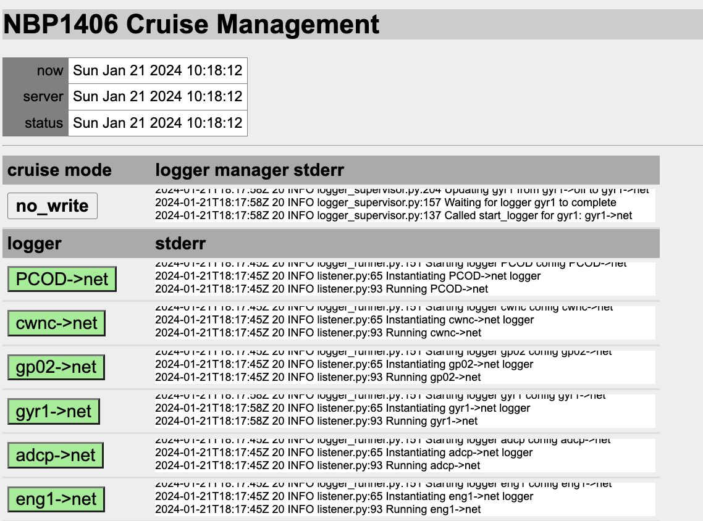
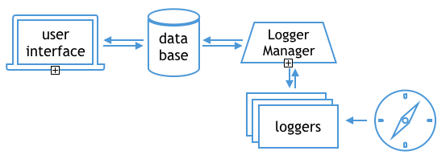

# OpenRVDAS Introduction and Overview
© 2018-2024 David Pablo Cohn - DRAFT 2024-02-20

## Table of Contents

- [Overview - needs and design philosophy](#overview---needs-and-design-philosophy)
  * [Design Philosophy](#design-philosophy)
- [Quick Start](#quick-start)
- [Architecture](#architecture)
  * [Running Loggers](#running-loggers)
  * [Controlling Multiple Loggers](#controlling-multiple-loggers)
  * [Controlling Multiple Loggers via Web Interface](#controlling-multiple-loggers-via-web-interface)
  * [Displaying Logger Data](#displaying-logger-data)
- [Roadmap](#roadmap)
- [More Documentation](#more-documentation)

## Overview - needs and design philosophy

One of the primary values a research vessel offers is the ability to gather accurate and timely scientific data wherever it travels. Most ships carry some combination of oceanographic, meteorological and other sensors and operate a system for storing, processing, analyzing and displaying the data they produce.

At present there are limited options for a ship wishing to operate such a system, and most either rely on a closed-source Windows-based solution (SCS) or on custom-crafted versions of software dating from the 1990's (dsLog, LDS). This limited choice means that expertise is wasted in maintaining fragmented code, or stifled while waiting for a monolithic system to implement feature requests.

The OpenRVDAS code base has been written from a clean slate as modular and extensible open source under the [MIT License](https://opensource.org/licenses/MIT). It is based on experience drawn from developing code on behalf of the US Antarctic Program and Antarctic Support Contract, and heavily informed by discussions and collaboration with members of the [RVTEC community](https://www.unols.org/committee/research-vessel-technical-enhancement-committee-rvtec).

The code base is written in Python 3 (tested extensively for 3.6.2 and above). Connector classes are implemented for using SQLite, MySQL and MariaDB as backing databases and MySQL, and the Django-based web interface is designed to be compatible with most modern browsers.

Please see [http://openrvdas.org](http://openrvdas.org) and [http://github.com/oceandatatools/openrvdas](http://github.com/oceandatatools/openrvdas) for the most recent code and documentation.

### Design Philosophy

Every ship will have different requirements, so no single system can hope to accommodate everyone's needs. In addition, those requirements will change from mission to mission and year to year, so no fixed system will be optimal for any length of time.

Because of this, instead of a system, we have focused on designing and building an architecture that allows easy assembly of small, modular components into whatever system is needed in a given situation.

## Quick Start

The simplest way to get started with OpenRVDAS is to bring up a clean dedicated Ubuntu 23 or
Centos 8 machine, either on actual hardware or as a virtual machine via a tool like [VirtualBox](https://www.virtualbox.org/).
(There is no reason why you _shouldn't_ run it on your personal laptop or other machine, but  if you do, you will need to
pay greater attention to which scripts are configured to start on boot.) 

_For the purposes of this introduction, we will assume that your have named the machine you will use `openrvdas`; if you
are using some other name then, obviously, use that name in place of `openrvdas` below._

1. Install the code following the instructions in the [OpenRVDAS Installation Guide](../INSTALL.md). Use default answers
when asked, and answer "yes" that OpenRVDAS should be started on boot up, and "yes" that the data simulator should be installed
and configured to run on start up.<br>


2. Assuming that the installation went smoothly (you received the 'Happy logging!' message at the end), 
open a web browser to [http://openrvdas:9001](http://openrvdas:9001). You should see the supervisord console indicating which scripts are running.

 

3. Assuming that all scripts are 'green', we'll run a couple of command line scripts to exercise the low-level pieces of
the system. Open a terminal window, go to the openrvdas installation directory and activate the virtual environment
defined there:
    ```
    su rvdas
    cd /opt/openrvdas
    source venv/bin/activate
    ```
4. The `emulate:simulate_nbp` line on the supervisord console indicates that a script is running that has created
"simulated" serial ports producing feeds of pre-recorded data from various instruments aboard the Nathaniel B. Palmer. These
ports have names/locations like `/tmp/tty_s330` (where we will, for example, find data from the ships Seapath 330 GPS).

    Try running a simple logger from the command line that reads from one of the simulated serial ports. E.g:
    ```
    logger/listener/listen.py --serial port=/tmp/tty_s330
    ```
   Do you see data? Hurrah!


5. Now let's go to the OpenRVDAS web console at [http://openrvdas](http://openrvdas) and try working with the whole system. If all has gone well during the installation, you will see a cruise management startup page like the one below:

    


6. Select the Log in link and log in as user __rvdas__. You should now see a "Load configuration file" button. Select it, and navigate to load the sample cruise definition file at ``test/NBP1406/NBP1406_cruise.yaml``.

    At this point you should see a table of loggers, all in configuration "off". A logger configuration is a set of instructions
 for what a logger should do with the data coming from its source. The configurations are defined in the cruise definition file
 you loaded, and typically each logger will have several configurations defined.

    Configurations can be as simple as writing the
 received data to a file or UDP port, or as complicated as parsing it, performing mathematical transformations on the values
 it contains, or even using those values to change the state of the logger or other loggers.`Off` means, as you would expect, that
 it should do nothing. 

    


7. If you select one of the buttons with a labeled logger configuration on it, such as `gyr1->off`, a dialog box will pop up
 with a dropdown menu allowing you to select one of the other configurations defined for that logger. It will also give you
 that logger's recent stderr output and, at the bottom of the box, the actual definition of the configuration in question.

   


8. Cruise modes are sets of logger configurations, a mapping from each logger to the configuration it should be in when the
 system is in a particular mode. In a typical cruise, the modes might be `Off`, `Port`, `EEZ` and `Underway`; in `Port` mode,
 for example, one might want the weather loggers to be running and storing data, but not the ship's Knudsen. Having cruise modes
 allows quickly and consistently setting all loggers to their desired configurations as the situation warrants.


9. Select the cruise mode "off" button, and it will open a window that allows you to select a different cruise mode, as well as see the logger manager's stderr in greater detail.

   


10. Select `no_write` from the pull-down menu and press "Change mode." After a few seconds of startup, the loggers should turn green and switch to "net" configuration, indicating that they are reading from their
 respective ports and writing UDP to the network (in this case, to port 6224), but not writing data to file.

    

     Selecting the `write` cruise mode will set the loggers to write their data both to UDP and to log files in 
 `/var/tmp/log/`. The two additional cruise modes - `no_write+influx` and `write+influx` - perform the same functions as `no_write` and `write`, but also send the parsed values to an InfluxDB database (if installed), where they can be
 read and displayed in Grafana graphs. InfluxDB and Grafana can be installed using the `utils/install_influxdb.sh`
script, as described on the [Grafana/InfluxDB](grafana_displays.md) page.


11. To verify that data are getting read and parsed, open a second browser window and direct it to [http://openrvdas/display/nbp_dashboard.html](http://openrvdas/display/nbp_dashboard.html) (again, assuming you named your openrvdas machine 'openrvdas'). You should see a set of dials, line charts and tables. If the system is in "monitor" mode, they should be updating.

    
 
What is going on here is that, in addition to writing raw data to port 6224, the loggers are also configured to send
 parsed data to a CachedDataServer via websocket (using a CachedDataWriter). The web console and some Highcharts-based
 and D3-based display widgets connect to the CachedDataServer via websockets and request data to display.

The sections below describe the architecture and the nature of logger configurations and control scripts in greater detail.

## Architecture

At the heart of OpenRVDAS is the idea of a "logger configuration" - a definition that specifies
what a logger should do. The "architecture" on which these definitions are built is made up of three basic classes of components: Readers, Transforms, and Writers, that can be "snapped together" to produce the necessary functionality. We have specified a simple API for these components and implemented a handful of the most useful ones in Python.[^1]


### Running Loggers

We can combine these components at a number of levels, from hand-coding Python routines that call them manually in turn to sophisticated scripts that assemble and run complex combinations of components from either command line options or YAML/JSON configuration files. For running a single logger from the command line, the [listen.py script](listen_py.md) provides a nice compromise of power and convenience:

```
  openrvdas> logger/listener/listen.py \
                 --serial port=/dev/tty_knud \
                 --transform_timestamp \
                 --transform_prefix knud \
                 --write_logfile /var/log/current_cruise/knud \
                 --write_udp 6224 \
                 --write_file -
  knud 2018-12-16T04:16:20.147283Z 3.5kHz,4410.18,0,,,,1500,-22.004162,-17.941308
  knud 2018-12-16T04:16:29.767645Z 3.5kHz,4409.00,0,,,,1500,-22.004472,-17.941574
  knud 2018-12-16T04:16:39.397700Z 3.5kHz,4410.41,0,,,,1500,-22.004796,-17.941868
  ...           
```

Please see [Introduction to Loggers](intro_to_loggers.md) for an in-depth exploration of other ways in which loggers may be assembled and run.

### Controlling Multiple Loggers

A typical vessel will want to log data from multiple sensors at once, and will want ways of monitoring logger health changing modes and restarting any failed processes. OpenRVDAS provides a pair of server scripts, logger\_runner.py and logger\_manager.py, that support that functionality.  Please see [Controlling Loggers](controlling_loggers.md) for information on running logger\_runner.py and logger\_manager.py.



### Controlling Multiple Loggers via Web Interface

OpenRVDAS supports logger monitoring and control through an API. It includes a Django-based web GUI based on this API that is described in the [Django Web Interface](django_interface.md) document.


### Displaying Logger Data

The preferred way to display live and historical OpenRVDAS data is to use the suite of InfluxDB and Grafana
tools that are installed and configured using the utils/install_influxdb.sh script, Please see the
[Grafana/InfluxDB](grafana_displays.md) page for information on using these tools.

OpenRVDAS does still ship with its own rudimentary facility for displaying live and
historical data using Javascript-based web widgets. Please see [Display Widgets](display_widgets.md) for details
on programming and serving widgets.

These widgets are by and large deprecated, and may cease working without notice in future updates.


## Roadmap

Please see the [Milestones](https://github.com/oceandatatools/openrvdas/milestones) page and [Projects](https://github.com/oceandatatools/openrvdas/projects) page for information on upcoming feature additions. For finer granularity, you may also look at the page of [issues and feature requests](https://github.com/oceandatatools/openrvdas/issues).

## More Documentation

In addition to the documents referenced above, some other relevant documents are:

-   [OpenRVDAS Components](components.md)
-   [Simulating Live Data](simulating_live_data.md)
-   [Running OpenRVDAS Loggers (web - deprecated)](https://docs.google.com/document/d/1w_wkdprtA31Fx4yTHLL6WoTtFrPmE3jskTeV6YSuOJI/edit)
-   [Parsing](parsing.md)
-   [Security assumptions](security.md)

[^1]: Recommended version of Python is 3.6 or higher, but most listener code has been verified to run on 3.5 and higher.
Server code such as `logger_runner.py` and `logger_manager.py` may experience problems on     3.5 due to changes in the async module.

