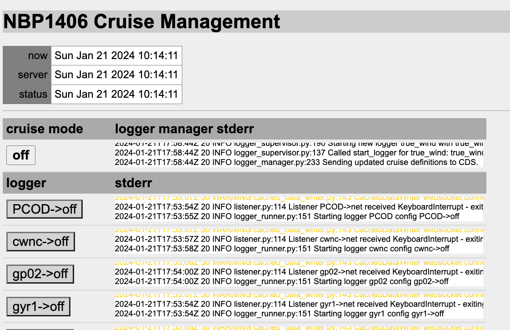

# OpenRVDAS Introduction and Overview
© 2018-2019 David Pablo Cohn - DRAFT 2019-06-26

## Table of Contents

- [Overview - needs and design philosophy](#overview---needs-and-design-philosophy)
  * [Design Philosophy](#design-philosophy)
- [Quick Start](#quick-start)
- [Architecture](#architecture)
  * [Running Loggers](#running-loggers)
  * [Controlling Multiple Loggers](#controlling-multiple-loggers)
  * [Controlling Multiple Loggers via Web Interface](#controlling-multiple-loggers-via-web-interface)
  * [Displaying Logger Data](#displaying-logger-data)
- [Roadmap](#roadmap)
- [More Documentation](#more-documentation)

## Overview - needs and design philosophy

One of the primary values a research vessel offers is the ability to gather accurate and timely scientific data wherever it travels. Most ships carry some combination of oceanographic, meteorological and other sensors and operate a system for storing, processing, analyzing and displaying the data they produce.

At present there are limited options for a ship wishing to operate such a system, and most either rely on a closed-source Windows-based solution (SCS) or on custom-crafted versions of software dating from the 1990's (dsLog, LDS). This limited choice means that expertise is wasted in maintaining fragmented code, or stifled while waiting for a monolithic system to implement feature requests.

The OpenRVDAS code base has been written from a clean slate as modular and extensible open source under the [MIT License](https://opensource.org/licenses/MIT). It is based on experience drawn from developing code on behalf of the US Antarctic Program and Antarctic Support Contract, and heavily informed by discussions and collaboration with members of the [RVTEC community](https://www.unols.org/committee/research-vessel-technical-enhancement-committee-rvtec).

The code base is written in Python 3 (tested extensively for 3.6.2 and above). Connector classes are implemented for using SQLite, MySQL and MariaDB as backing databases and MySQL, and the Django-based web interface is designed to be compatible with most modern browsers.

Please see [http://openrvdas.org](http://openrvdas.org) and [http://github.com/oceandatatools/openrvdas](http://github.com/oceandatatools/openrvdas) for the most recent code and documentation.

### Design Philosophy

Every ship will have different requirements, so no single system can hope to accommodate everyone's needs. In addition, those requirements will change from mission to mission and year to year, so no fixed system will be optimal for any length of time.

Because of this, instead of a system, we have focused on designing and building an architecture that allows easy assembly of small, modular components into whatever system is needed in a given situation.

## Quick Start

The surest (and still simplest) way to get started with OpenRVDAS is to bring up a clean dedicated Ubuntu 18 or Centos 7 machine in a virtual environment such as [VirtualBox](https://www.virtualbox.org/).

Install the code following the instructions in the [OpenRVDAS Installation Guide](../INSTALL.md). Use default answers when asked, and answer "yes" that OpenRVDAS should be started on boot up.

Once you have logged back on, open two terminal windows.

1. The sample cruise configuration file in [test/NBP1406/NBP1406_cruise.yaml](../test/NBP1406/NBP1406_cruise.yaml) assumes the existence of a set of virtual serial ports; we'll run a script __as user rvdas__ to create those ports and start feeding them sample cruise data:
```
  su rvdas
  cd /opt/openrvdas
  logger/utils/simulate_data.py --config test/NBP1406/simulate_NBP1406.yaml
```

2. In the other window, run a logger to verify that the serial ports are functioning as expected:
 ```
  cd /opt/openrvdas
  logger/listener/listen.py --serial port=/tmp/tty_s330
 ```
 
 This says to create a reader (SerialReader) that will listen to port ''/tmp/tty_s330''; there are no writers specified, so the ``listen.py`` script will pipe output to stdout.

3. Try reading from the serial port, timestamping the data and saving it to a file:
```
  logger/listener/listen.py --serial port=/tmp/tty_s330 --transform_timestamp --write_file /tmp/s330.log
```

4. Open a web browser and direct it to http://openrvdas (assuming you named your openrvdas machine 'openrvdas'). You may need to edit your local host machine's ``/etc/host`` to include the name and IP address of your openrvdas machine for this to work.

 If all has gone well, you will see a cruise management startup page like the one below:

 

 Select the Log in link and log in as user __rvdas__. You should now see a "Load configuration file" button. Select it, and navigate to load the sample cruise definition file at ``test/NBP1406/NBP1406_cruise.yaml``.

 At this point you should see a table of loggers, all in configuration "off". Scroll to the bottom of the page, where there is a "Mode" selector. Select "monitor" and press "Change mode."

 

 After a few seconds of startup, the loggers should turn green and switch to "net" configuration, indicating that they are writing UDP to the network (in this case, to port 6224). You can verify this with another listener:

 ```
  logger/listener/listen.py --udp 6224
 ```

 You can change the active configuration of individual loggers by clicking on the button bearing the name of the current configuration.

4. Open a second browser window and direct it to http://openrvdas/display/nbp_basic.html (again, assuming you named your openrvdas machine 'openrvdas'). You should see a set of dials, line charts and tables. If the system is in "monitor" mode, they should be updating.

 
 
 What is going on here is that, in addition to writing raw data to port 6224, the loggers are also configured to send parsed data to a CachedDataServer via websocket (using a CachedDataWriter). The web console and display widgets connect to the CachedDataServer via websockets and request data to display.

The sections below describe the architecture and control scripts in greater detail.

## Architecture

The core logger architecture is made up of three basic classes of components: Readers, Transforms, and Writers, that can be "snapped together" to produce the necessary functionality. We have specified a simple API for these components and implemented a handful of the most useful ones in Python.[^1]


### Running Loggers

We can combine these components at a number of levels, from hand-coding Python routines that call them manually in turn to sophisticated scripts that assemble and run complex combinations of components from either command line options or YAML/JSON configuration files. For running a single logger from the command line, the [listen.py script](listen_py.md) provides a nice compromise of power and convenience:

```
  openrvdas> logger/listener/listen.py \
                 --serial port=/dev/tty_knud \
                 --transform_timestamp \
                 --transform_prefix knud \
                 --write_logfile /var/log/current_cruise/knud \
                 --write_udp 6224 \
                 --write_file -
  knud 2018-12-16T04:16:20.147283Z 3.5kHz,4410.18,0,,,,1500,-22.004162,-17.941308
  knud 2018-12-16T04:16:29.767645Z 3.5kHz,4409.00,0,,,,1500,-22.004472,-17.941574
  knud 2018-12-16T04:16:39.397700Z 3.5kHz,4410.41,0,,,,1500,-22.004796,-17.941868
  ...           
```

Please see [Introduction to Loggers](intro_to_loggers.md) for an in-depth exploration of other ways in which loggers may be assembled and run.

### Controlling Multiple Loggers

A typical vessel will want to log data from multiple sensors at once, and will want ways of monitoring logger health changing modes and restarting any failed processes. OpenRVDAS provides a pair of server scripts, logger\_runner.py and logger\_manager.py, that support that functionality.  Please see [Controlling Loggers](controlling_loggers.md) for information on running logger\_runner.py and logger\_manager.py.


### Controlling Multiple Loggers via Web Interface

OpenRVDAS supports logger monitoring and control through an API. It includes a Django-based web GUI based on this API that is described in the [Django Web Interface](django_interface.md) document.


### Displaying Logger Data

In addition to simply transforming and storing data, OpenRVDAS includes a (still rudimentary) facility for displaying live and historical data using Javascript-based web widgets. Please see [Display Widgets](display_widgets.md) for details on programming and serving widgets.


## Roadmap

Please see the [Milestones](https://github.com/oceandatatools/openrvdas/milestones) page and [Projects](https://github.com/oceandatatools/openrvdas/projects) page for information on upcoming feature additions. For finer granularity, you may also look at the page of [issues and feature requests](https://github.com/oceandatatools/openrvdas/issues).

## More Documentation

In addition to the documents referenced above, some other relevant documents are:

-   [OpenRVDAS Components](components.md)
-   [Simulating Live Data](simulating_live_data.md)
-   [Running OpenRVDAS Loggers (web - deprecated)](https://docs.google.com/document/d/1w_wkdprtA31Fx4yTHLL6WoTtFrPmE3jskTeV6YSuOJI/edit)
-   [Parsing](parsing.md)
-   [Security assumptions][security.md]

[^1]: Recommended version of Python is 3.6 or higher, but most listener     code has been verified to run on 3.5 and higher. Server code such as     logger\_runner.py and logger\_manager.py may experience problems on     3.5 due to changes in the async module.

