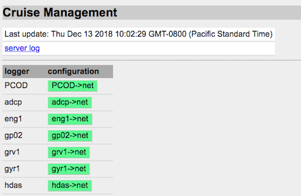

# OpenRVDAS Introduction to Loggers
© 2018 David Pablo Cohn
 DRAFT 2018-08-09

## Table of Contents

* [Overview - needs and design philosophy](#overview---needs-and-design-philosophy)
   * [Design Philosophy](#design-philosophy)
   * [Architecture](#architecture)
   * [Document Roadmap](#document-roadmap)
* [Defining simple loggers from the command line](#defining-simple-loggers-from-the-command-line)
* [Logger configuration files](#logger-configuration-files)
* [Running multiple loggers with logger_runner.py](#running-multiple-loggers-with-logger_runnerpy)
* [Managing multiple loggers with logger_manager.py](#managing-multiple-loggers-with-logger_managerpy)
   * [Cruises, modes and configurations](#cruises-modes-and-configurations)
   * [Running logger_manager.py from the command line](#running-logger_managerpy-from-the-command-line)
   * [Managing loggers via a web interface](#managing-loggers-via-a-web-interface)
* [Appendix](#appendix)
   * [Installation](#installation)
      * [Installation scripts](#installation-scripts)
      * [Manual installation](#manual-installation)
   * [Testing](#testing)
   * [Using Stored/Simulated Data](#using-storedsimulated-data)
* [Roadmap](#roadmap)
   * [Derived data values](#derived-data-values)
   * [Automatic component discovery and incorporation](#automatic-component-discovery-and-incorporation)
* [More Documentation](#more-documentation)

## Overview - needs and design philosophy

One of the primary values a research vessel offers is the ability to gather accurate and timely scientific data wherever it travels. Most ships carry some combination of oceanographic, meteorological and other sensors and operate a system for storing, processing, analyzing and displaying the data they produce.

At present there are limited options for a ship wishing to operate such a system, and most either rely on a closed-source Windows-based solution (SCS) or on custom-crafted versions of software dating from the 1990's (dsLog, LDS). This limited choice means that expertise is wasted in maintaining fragmented code, or stifled while waiting for a monolithic system to implement feature requests.

The OpenRVDAS code base has been written from a clean slate as modular and extensible open source under the [MIT License](https://opensource.org/licenses/MIT). It is based on experience drawn from developing code on behalf of the US Antarctic Program and Antarctic Support Contract, and heavily informed by discussions and collaboration with members of the [RVTEC community](https://www.unols.org/committee/research-vessel-technical-enhancement-committee-rvtec).

The code base is written in Python 3 (tested extensively for 3.6.2 and above). Connector classes are implemented for using SQLite, MySQL and MariaDB as backing databases and MySQL, and the Django-based web interface is designed to be compatible with most modern browsers.

Please see [http://openrvdas.org](http://openrvdas.org) and [http://github.com/davidpablocohn/openrvdas](http://github.com/davidpablocohn/openrvdas) for the most recent code and documentation.

### Design Philosophy

Every ship will have different requirements, so no single system can hope to accommodate everyone's needs. In addition, those requirements will change from mission to mission and year to year, so no fixed system will be optimal for any length of time.

Because of this, instead of a system, we have focused on designing and building an architecture that allows easy assembly of small, modular components into whatever system is needed in a given situation.

### Architecture

The core logger architecture is made up of three basic classes of components: Readers, Transforms, and Writers, that can be "snapped together" to produce the necessary functionality. We have specified a simple API for these components and implemented a handful of the most useful ones in Python.[^1]

If we want to work down at the code level, we can combine these components in a very few lines of Python to build a full-fledged logger that reads an instrument serial port, timestamps and stores the record to file, and forwards it via UDP for displays or other waiting processes:

```
def logger(port, instrument):
  reader = SerialReader(port=port, baudrate=9600)
  ts_transform = TimestampTransform()
  prefix_transform = PrefixTransform(instrument)
  network_writer = NetworkWriter(':6224')
  logfile_writer = LogfileWriter('/log/current/%s' % instrument)
  
  while True:
    record = reader.read()
    timestamped_record = ts_transform.transform(record)
    prefixed_record = prefix_transform.transform(timestamped_record)
    logfile_writer.write(timestamped_record)
    network_writer.write(prefixed_record)
```


Please see the document [OpenRVDAS Components](components.md) for a list and descriptions of currently-implemented Readers, Transforms and Writers.

### Document Roadmap

This document describes the architecture, its components, tools and scripts, from the bottom up.

-   **Architecture and logger components:** We begin with a description of how to "manually" connect Readers, Transforms and Writers in Python code.
-   **Running simple loggers:** The listen.py script is a powerful command line tool for invoking and combining some of the most common components from the command line.
-   **Running more complex loggers using configuration files:** a format for "canning" more complex logger dataflows.
-   **Running multiple loggers:** A typical ship installation will require running multiple loggers at once.
    -   The **logger\_runner.py** script will run load and run a set of     logger configurations, attempting to restart any that fail.
    -   The **logger\_manager.py** script allows loading, modifying and     monitoring sets of logger configurations, either from the     command line or as part of a system service. In addition to     running processes locally, it can dispatch configurations to     logger\_runner.py processes running on remote machines.
    -   A **Django-based web server** can connect to the     logger\_manager.py script via a websocket, allowing authorized     users on the network to control and monitor logger processes     from a browser window.

## Defining simple loggers from the command line

The listen.py script incorporates the most common Readers, Transforms and Writers, providing much of the functionality that one might want in a logger straight from the command line. For example, the invocation:

```
listen.py \
  --serial port=/dev/ttyr15,baudrate=9600 \
  --transform_timestamp \
  --transform_prefix gyr1 \
  --write_logfile /log/current/gyr1 \
  --write_network :6224
```
implements the following data flow:


## Logger configuration files

For logger workflows of non-trivial complexity, we recommend that users forgo specifying Readers, Transforms and Writers on the command line in favor of using configuration files.

A configuration file is a YAML or JSON (a subset of YAML) specification of components along with their parameters. It may be invoked using the `--config_file` argument:

```
logger/listener/listen.py --config_file gyr_logger.yaml
```
where gyr_logger.yaml consists of the YAML/JSON definition

```
{ 
   "readers": { 
     "class": "SerialReader", 
     "kwargs": { 
       "port": "/dev/ttyr15", 
       "baudrate": 9600 
     }
   }, 
   "transforms": [ 
     { 
       "class": "TimestampTransform" 
       // NOTE: no keyword args 
     }, 
     { 
       "class": "PrefixTransform", 
       "kwargs": { 
         "prefix": "gyr1" 
       }
     }  
   ], 
   "writers": [ 
     { 
       "class": "LogfileWriter", 
       "kwargs": { 
         "filebase": "/log/current/gyr1" 
       } 
     }, 
     { 
       "class": "NetworkWriter", 
       "kwargs": { 
         "network": ":6224" 
       } 
     } 
   ] 
}
```
Use of listen.py script with and without configuration files is described in [The Listener Script](listen_py.md); configuration files are described in detail in [OpenRVDAS Configuration Files](configuration_files.md).

## Running multiple loggers with logger\_runner.py

The listen.py script is handy for running a single logger from the command line. For more sophisticated logger management, the logger\_runner.py script is provided. The latter takes as its input a YAML or JSON file defining a dict of configurations that are to be run, where the keys are (convenient) configuration names, and the values are the different configurations themselves.

```server/logger_runner.py --config test/config/sample_configs.yaml -v```

The sample_configs.yaml file should be a YAML or JSON-formatted dictionary:

```
{
  "gyr1": {...configuration for gyr1...},
  "mwx1": {...configuration for mwx1...},
  "s330": {...configuration for s330...},
  ...
}
```
where each config is in the format described above under [Running with configuration files](#running-more-complicated-loggers-with-configuration-files).

Note that the provided test/config/sample_configs.yaml specifies configurations that read simulated data from virtual serial ports. To create those ports and begin feeding them with data, you'll need to run

```
logger/utils/simulate_serial.py --config test/serial_sim.yaml --loop
```
in a separate terminal. To observe the data being logged by the above sample configs, you can start a Listener in yet another terminal:

```
logger/listener/listen.py --network :6224 --write_file -
```
Please see the [server/README.md](../server/README.md) file and [logger_runner.py](../server/logger_runner.py) headers for the most up-to-date information on running logger\_runner.py.

## Managing multiple loggers with logger\_manager.py

The logger\_runner.py script will run a set of loggers and retry them if they fail, but it doesn't provide any way of modifying their behaviors other than killing them all and re-running with a new set of configurations. The [logger\_manager.py](../server/logger_manager.py) script is a powerful wrapper around logger\_runner.py.

### Cruises, modes and configurations

Before we dive into the use of logger\_manager.py, it's worth pausing for a moment to introduce some concepts that underlie the structure of the logger manager. _(Note: much of this section should be moved to [OpenRVDAS Configuration Files](configuration_files.md))._

-   **Logger configuration** - This is a definition for a set of Readers, Transforms and Writers feeding into each other, such as would be read using the --config argument of the listen.py script. In OpenRVDAS, each logger configuration that is active runs as its own daemon process.  The sample logger configuration below ("knud-\>net") reads NMEA data from the Knudsen serial port, timestamps and labels the record, then broadcasts it via UDP:

  ```
  "knud->net": {
    "host_id": "knud.host",
    "name": "knud->net",
    "readers": {
      "class": "SerialReader",
      "kwargs": {
        "port": "/tmp/tty_knud",
        "baudrate": 9600
      }
    },
    "transforms": {
      "class": "TimestampTransform"
    },
    "writers": {
    "class": "ComposedWriter",
      "kwargs": {
        "transforms": {
          "class": "PrefixTransform",
          "kwargs": {
            "prefix": "knud"
          }
        },
        "writers": {
          "class": "NetworkWriter",
          "kwargs": {
            "network": ":6224"
      }
    }
  }
  ```
-   **Cruise mode (or just "mode")** - Logger configurations can be grouped into logical collections that will be active at any given time. Certain logger configurations will be running when a vessel is in port; another set may be running while the vessel is at sea, but within territorial waters; yet another when it is fully underway. usually just called a "mode".  The mode definition below indicates that when "port" mode is active, the configurations "gyr1-\>net", "mwx1-\>net", "s330-\>net" and "eng1-\>net" should be running:

  ```
  "modes": { 
    "off": {}, 
    "port": { 
      "gyr1": "gyr1->net", 
      "mwx1": "mwx1->net", 
      "s330": "s330->net", 
      "eng1": "eng1->net", 
      "knud": "knud->off", 
      "rtmp": "rtmp->off" 
    }, 
    "underway": {...} 
  }
  ```
-   **Cruise configuration** - (or just "configuration" when we're being sloppy). This is the file/JSON/YAML structure that contains everything the logger manager needs to know about running a cruise. In addition to containing cruise metadata (cruise id, provisional start and ending dates) a cruise configuration contains a collection of all the logger configurations that are to be run on a particular vessel deployment, along with definitions for all the modes in which those configurations are to be run. A cruise configuration file (such as in [test/configs/sample\_cruise.yaml](../test/configs/sample\_cruise.yaml)) defines the loggers for a cruise and the configurations they may take, as well as the modes into which they are grouped.  
  
It is worth noting that in OpenRVDAS, a "logger" does not exist as a separate entity. It is just a convenient way of thinking about a set of configurations that are responsible for a given data stream, e.g. Knudsen data, or a GPS feed. This is evident when looking at the sample cruise definition file, as the logger definition ("knud") is just a list of the configurations that are responsible for handling the

```
"knud": {
  "configs": [
    "knud->off",
    "knud->net",
    "knud->file/net/db"
  ]
}
```
Perusing a complete cruise configuration file, such as [test/configs/sample_cruise.yaml](../test/configs/sample_cruise.yaml) may be useful for newcomers to the system.

### What the logger manager does

In short, a bunch of stuff.

* On startup, it consults a database (either a transient in-memory one, or a Django-based one, depending on the value of the ```--database``` flag) to determine what loggers, logger configurations and cruise modes exist, and which cruise mode or combination of logger configurations the user wishes to have running. If a cruise configuration and/or mode are specified on startup via the ```--config``` and ```--mode``` flags, it stores those in the database as the new logger configuration definitions and desired cruise mode.

* It starts/stops logger processes using the desired logger configurations specified by the database and records the new logger states in the database. Once started, it monitors the health of theses processes, recording failures in the database and restarting processes as necessary.

* If the ```--websocket :[port]``` flag has been specified, it provides several services to clients that connect via the websocket:

  * Logger status updates via connections to a websocket at ```hostname:port/logger_status```. This service may be used by web clients, such as the logger monitoring/control page provided by the Django GUI.

      

  * Logger messages, warnings and errors to clients that connect to ```hostname:port/messages/[log level]/[source]```, where log level and source are optional arguments.

      

  * Access to a DataServer that provides logged data for clients that connect to ```hostname:port/data```. Such clients might be web display widgets or independent loggers that produce derived data (such as true winds, or computed wind chill temperature). Note that this functionality is somewhat rudimentary, and assumes that the desired data is being logged to a DatabaseWriter using the default settings. A recommended alternative is to have web display widgets and derived data loggers connect to an independently-running DataServer, such as the [network_data\_server.py](../server/network_data_server.py).

      

  * Control of remote logger runner processes. A cruise configuration file may specify that certain loggers may only run on certain machines (via a ```host_id``` field in the definition). This may be desirable if, for example, the required serial ports are only available on a particular machine. A remote host like this may connect to a logger manager via the invocation
      
      ```
      server/logger_runner.py --websocket <logger manager host>:<port> \
          --host_id knud.host
      ```
      
      to indicate that it is available to run logger configurations that are restricted to host ```knud.host```. The logger manager will dispatch any such logger configurations to this logger runner process.

      Note that this also provides a mechanism for manual load sharing if, for example, some logger processes are particularly compute intensive.

### Running logger\_manager.py from the command line

The logger\_manager.py script can be run with no arguments and will default to using an in-memory data store:

```
server/logger_manager.py
```
You can type "help" for a full list of commands, but a sample of the available functionality is

**Load a cruise configuration**

```
command? load_configuration test/nmea/NBP1406/NBP1406_cruise.yaml
command? 
```

**See what loggers are defined**

```
command? get_loggers
Loggers: PCOD, adcp, eng1, gp02, grv1, gyr1, hdas, knud, mbdp, mwx1, pco2, pguv, rtmp, s330, seap, svp1, true_winds, tsg1, tsg2
command?

**Get and change cruise modes**

```
command? get_modes
Available Modes: off, port, monitor, monitor and log
command? get_active_mode
Current mode: off
command? set_active_mode port
command? 
```

**Manually change logger configurations**

```
command? get_logger_configs gyr1
Configs for gyr1: gyr1->off, gyr1->net, gyr1->file/net/db
command? set_active_logger_config gyr1 gyr1->file/net/db
command? quit
```
As with sample script for logger\_runner.py, test/nmea/NBP1406/NBP1406\_cruise.yaml attempts to read from virtual serial ports, so you'll need to run logger/utils/simulate\_serial.py for it to run without complaining.

### Other invocation options

If Django is installed and configured, you may also direct the logger manager to use the Django database when you invoke it. This has several advantages, the chief one being that desired logger states and modes will be preserved between runs of the logger manager (so that, for example, if the machine on which it is running is rebooted, the logger manager will restart the loggers that were running at the time.)

```
    server/logger_manager.py --database django
```

The logger manager may also be invoked with a websocket specification, which will allow communicating with it via the Django interface, and will enable the additional websocket-based services described above:

```
    server/logger_manager.py --database django --websocket :8765
```

Finally, the logger manager may be invoked with a cruise configuration and/or cruise mode, and will attempt to load and run the loggers specified in it:

```
    server/logger_manager.py --config test/nmea/NBP1406/NBP1406_cruise.yaml \
        --mode monitor
```

Please see the [server/README.md](../server/README.md) file and [logger_manager.py](../server/logger_manager.py) headers for the most up-to-date information on running logger\_manager.py.

### Managing loggers via a web interface

There is a still-rudimentary Django-based GUI for controlling logger\_manager.py via a web interface. If you have installed OpenRVDAS using one of the utility installation scripts described in the appendix, they will have installed the NGINX web server and logger\_manager.py to run as system services. Please see the [OpenRVDAS Web Interface (web)](django_interface.md) and [django_gui/README.md](../django_gui/README.md) for up-to-date information.

## Appendix

### Installation

#### Installation scripts

There are rudimentary but complete system installation/configuration scripts available for CentOS 7 and Ubuntu 16 in [the project's utils directory](../utils). When copied over to a "bare" operating system installation and run, they will prompt for configuration information and download/install/configure all the files needed to run the complete OpenRVDAS system, including database and web interface.

As of this writing, the CentOS and Ubuntu scripts provide a fairly complete installation, not only installing and configuring all database and web components, but configuring the logger\_manager.py as a system service and giving the option of having it automatically run on boot.

#### Manual installation

The rvdas logger code is designed to be minimally system dependent, and to run on Python 3.6.2 or later. If you have git installed, then you can retrieve it by typing

```
git clone https://github.com/davidpablocohn/openrvdas.git
```
Otherwise, you can download it by visiting [https://github.com/davidpablocohn/openrvdas/archive/master.zip](https://github.com/davidpablocohn/openrvdas/archive/master.zip) and uncompressing the retrieved archive.

You should be able to cd to the openrvdas directory, and begin using the logger/listener/listen.py script directly.

Using some of the OpenRVDAS components (such as SerialReader, DatabaseReader and DatabaseWriter), as well as the Django-based web interface, may require additional Python and system packages to be installed and configured. The details of these requirements are described in [the project's INSTALL.md file](../INSTALL.md), and in the [database/README.md](../database/README.md) and [django_gui/README.md](../django_gui/README.md) files of the relevant components.

### Testing

Code coverage with unit tests has been a tenet in the development of this code; every file foo.py that contains functional code should also have a corresponding test_foo.py file that exercises that code. Beyond verifying the functionality of target code, unit tests also provide users with working examples of how that target code should be called, and simple templates for exploring its modification.

Tests can be run as individual python executables, and many (but not yet all) accept -v flags to increase the verbosity of the test (a single '-v' sets logging level to "info"; a second -v sets it to "debug").

To run all tests in a particular directory, use

```
python3 -m unittest discover <module path>
```
from the base RVDAS directory, e.g.

```
python3 -m unittest discover logging.readers
```
To run all tests, just omit the module path.

Note that some tests are timing dependent and may fail if all tests are run at once (via `python3 -m unittest discover` from the home directory) on slower systems.[^4] If you encounter test failures, try re-running just the tests the directory that failed.

### Using Stored/Simulated Data

It can be very useful, during development or testing, to run using saved log files as synthetic input, and some sample synthetic data are included in the test/ subdirectory for that purpose. For systems that expect their data to arrive via UDP, simulation can be set up using the listen.py script to connect a LogfileReader to a NetworkWriter, e.g.

```
logger/listener/listen.py \
    --logfile test/nmea/NBP1700/gyr1/raw/NBP1700_gyr1-2017-11-04 \
    --transform_timestamp \
    --transform_prefix gyr1 \
    --write_network :6224
```
Simulating a system that uses serial ports for its input is more involved. We provide a rudimentary serial port simulation in logger/utils/simulate_serial.py. The file defines a SimSerial class and a command line script that invokes it:

```
logger/utils/simulate_serial.py \
    --port /dev/ttyr15 \
    --logfile test/nmea/NBP1700/gyr1/raw/NBP1700_gyr1-2017-11-04 \
    --loop
```
tries to create virtual serial port /dev/ttyr15 and feeds it with data from the specified logfile, timing the records to arrive at the same intervals indicated between timestamps in the logfile.

Note that if you wish to actually create virtual serial ports in /dev (perhaps corresponding to some port.tab definition), you will need to run the script as root, and if those ports actually exist, the script *WILL WIPE THEM OUT*.

Because of this, we recommend that you specify a different location for your simulated ports, such as /tmp/ttyr15, etc.

To simplify the creation/testing, simulate_serial.py can also take a YAML or JSON-format[^6] configuration file such as the one in [test/serial\_sim.yaml](../test/serial_sim.yaml), specifying a complete set of virtual serial port-log file pairings:

```
logger/utils/simulate_serial.py --config test/serial_sim.yaml --loop
```
Simulating a system that takes its input from serial ports is more involved. Please see [Simulating Serial Input](simulating_serial_input.md) for information on how to set up and feed virtual serial ports.

## Roadmap

### Derived data values

See the [Derived Data Loggers document](derived_data.md) for the state of derived data loggers.

### Generalized dataflow

The pipeline implemented by listen.py is convenient, but necessarily limiting. A more general model supporting an arbitrary dataflow graph would allow more efficient data processing.

An execution model in which each component ran as a node in its own thread (or even process) and pushed its output to the input queue of other specified nodes doesn't seem like it would be all that hard to define or implement.


### Automatic component discovery and incorporation

It would be nice to have smarter version of the listen.py script that found what readers, transforms and writers were available, what arguments they took, and was able to automatically incorporate those components and arguments into a command line interface.

There are plenty of desirable features that we've not yet figured out how to implement (well).

## More Documentation

For now, documentation is in transition from an online Google Docs folder in [http://tinyurl.com/openrvdas-docs](http://tinyurl.com/openrvdas-docs) to [Github-based markdown in this directory](.).

Some other relevant documents are:

-   [OpenRVDAS Django Web Interface](django_interface.md)
-   [OpenRVDAS Components](components.md)
-   [Simulating Serial Input](simulating_serial_input.md)
-   [Running OpenRVDAS Loggers (web - deprecated)](https://docs.google.com/document/d/1w_wkdprtA31Fx4yTHLL6WoTtFrPmE3jskTeV6YSuOJI/edit)
-   [NMEA Parsing](nmea_parser.md)

[^1]: Recommended version of Python is 3.6 or higher, but most listener     code has been verified to run on 3.5 and higher. Server code such as     logger\_runner.py and logger\_manager.py may experience problems on     3.5 due to changes in the async module.

[^2]: Here is another opportunity to get bitten by the     command-line-ordering gotcha: in order to apply to a file, --tail     and --refresh_file_spec must appear on the command line before     the --file argument. And at present, once they're "on" there's     no way to turn them off for subsequent --file/\--logfile arguments.

[^3]: */CRUISE/instrument/raw/MAKE_MODEL-DATE*

[^4]: Yes, this is a bug, but at present a relatively low priority one.

