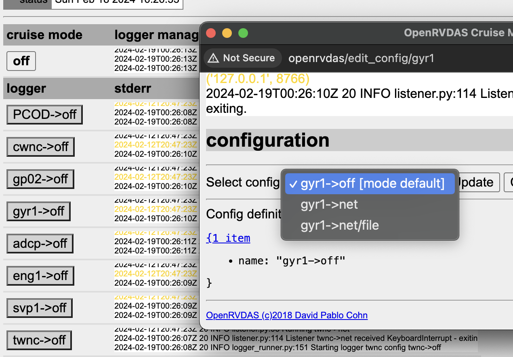
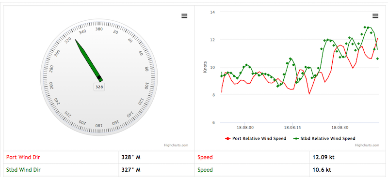

# OpenRVDAS GUI Quickstart
© 2018-2024 David Pablo Cohn - DRAFT 2024-05-16

## Table of Contents

- [Overview](#overview)
- [Installation and Quickstart](#installation-and-quickstart)
- [Under the Hood](#under-the-hood)
- [Displaying Logger Data](#displaying-logger-data)
  - [InfluxDB/Grafana](#influxdb/grafana)
  - [Highcharts + native](#highcharts-+-native)

## Overview
This document describes basic installation of the full OpenRVDAS package and basic manipulation of its graphic user interface. A separate [OpenRVDAS Quickstart](quick_start.md) document describes how to configure simple OpenRVDAS loggers and run them from the command line.

## Installation and Quickstart
The simplest way to get started with OpenRVDAS is to bring up a clean dedicated Ubuntu 23 or
Centos 8 machine, either on actual hardware or as a virtual machine via a tool like [VirtualBox](https://www.virtualbox.org/).
(There is no reason why you _shouldn't_ run it on your personal laptop or other machine, but  if you do, you will need to
pay greater attention to which scripts are configured to start on boot.) 

_For the purposes of this introduction, we will assume that your have named the machine you will use `openrvdas` and that your OpenRVDAS user will be named __rvdas__; if you are using some other name then, obviously, use that name in place of `openrvdas`/`rvdas` below._

1. Install the code following the instructions in the [OpenRVDAS Installation Guide](../INSTALL.md). Use default answers when asked 
   * answer "yes" that OpenRVDAS should be started on boot
   * answer "yes" that the data simulator should be installed and started on boot


2. Assuming that the installation went smoothly (you received the 'Happy logging!' message at the end), open a web browser to [http://openrvdas:9001](http://openrvdas:9001). You should see the supervisord console indicating which scripts are running.

 

3. Assuming that all scripts are 'green', we'll run a couple of command line scripts to exercise the low-level pieces of the system. Open a terminal window, go to the openrvdas installation directory and activate the virtual environment.    OpenRVDAS installs within a virtual environment so that packages it installs don't interfere with existing packages. 
    ```
    su rvdas
    cd /opt/openrvdas
    source venv/bin/activate
    ```


4. The `simulate:simulate_nbp` line on the supervisord console indicates that a script is running that has created
"simulated" serial ports producing feeds of pre-recorded data from various instruments aboard the Nathaniel B. Palmer. These
ports have names/locations like `/tmp/tty_s330` (where we will, for example, find data from the ships Seapath 330 GPS).

    Try running a simple logger from the command line that reads from one of the simulated serial ports. E.g:
    ```
    logger/listener/listen.py --serial port=/tmp/tty_s330
    ```
   Do you see data? Hurrah!


5. Now let's go to the OpenRVDAS web console at [http://openrvdas](http://openrvdas) and try working with the whole system. If all has gone well during the installation, you will see a cruise management startup page like the one below:

    


6. Select the Log in link and log in as user __rvdas__ (or whichever user you created). You should now see a "Load configuration file" button. Select it, and navigate to load the sample cruise definition file at ``test/NBP1406/NBP1406_cruise.yaml``.<p>


7. At this point you should see a table of loggers, all in configuration "off". A logger configuration is a set of instructions for what a logger should do with the data coming from its source. The configurations are defined in the cruise definition file you loaded, and typically each logger will have several configurations defined.<br><br>

    Configurations can be as simple as writing the
 received data to a file or UDP port, or as complicated as parsing it, performing mathematical transformations on the values
 it contains, or even using those values to change the state of the logger or other loggers.`Off` means, as you would expect, that
 it should do nothing. 


    


8. If you select one of the buttons with a labeled logger configuration on it, such as `gyr1->off`, a dialog box will pop up
 with a dropdown menu allowing you to select one of the other configurations defined for that logger. It will also give you
 that logger's recent stderr output and, at the bottom of the box, the actual definition of the configuration in question.

   


9. Cruise modes are sets of logger configurations, a mapping from each logger to the configuration it should be in when the
 system is in a particular mode. In a typical cruise, the modes might be `Off`, `Port`, `EEZ` and `Underway`; in `Port` mode,
 for example, one might want the weather loggers to be running and storing data, but not the ship's Knudsen. Having cruise modes
 allows quickly and consistently setting all loggers to their desired configurations as the situation warrants.


10. Select the cruise mode "off" button, and it will open a window that allows you to select a different cruise mode, as well as see the logger manager's stderr in greater detail.

   


11. Select `no_write` from the pull-down menu and press "Change mode." After a few seconds of startup, the loggers should turn green and switch to "net" configuration, indicating that they are reading from their
 respective ports and writing UDP to the network (in this case, to port 6224), but not writing data to file.

    

     Selecting the `write` cruise mode will set the loggers to write their data both to UDP and to log files in 
 `/var/tmp/log/`. The two additional cruise modes - `no_write+influx` and `write+influx` - perform the same functions as `no_write` and `write`, but also send the parsed values to an InfluxDB database (if installed), where they can be
 read and displayed in Grafana graphs. InfluxDB and Grafana can be installed using the `utils/install_influxdb.sh`
script, as described on the [Grafana/InfluxDB](grafana_displays.md) page.


12. To verify that data are getting read and parsed, open a second browser window and direct it to [http://openrvdas/display/nbp_dashboard.html](http://openrvdas/display/nbp_dashboard.html) (again, assuming you named your openrvdas machine 'openrvdas'). You should see a set of dials, line charts and tables. If the system is in "monitor" mode, they should be updating.

    
 
What is going on here is that, in addition to writing raw data to port 6224, the loggers are also configured to send
 parsed data to a CachedDataServer via websocket (using a CachedDataWriter). The web console and some Highcharts-based
 and D3-based display widgets connect to the CachedDataServer via websockets and request data to display.

The sections below describe the architecture and the nature of logger configurations and control scripts in greater detail.

## Under the Hood
What's going on here is that the supervisor daemon is running a handful of Python scripts, most centrally, one called `logger_manager.py`. The logger manager consults a database to see what loggers exists, and which logger configurations should be running, then starts/stops the appropriate processes accordingly.

Rather than talking to the logger manager directly, we use the Django-based GUI to read/write the database to update what the logger manager should be doing.


Please see [Controlling Loggers](controlling_loggers.md) for information on running logger\_runner.py and logger\_manager.py.

A command-line interface, `servers/lmcmd.py`, allows another way of connecting to the Django database to issue commands and get status updates.
```buildoutcfg
/opt/openrvdas$ server/lmcmd.py
command? help
Valid commands:
  load_configuration <configuration file name>
      Load a new config from file and set to default mode
  reload_configuration
      Reload the current configuration file and update any loggers whose that configurations have changed
  set_configuration <JSON encoding of a configuration>
      Load a new configuration from passed JSON encoding
  delete_configuration
      Delete the current configuration from the server

  get_active_mode
      Get currently active mode
  get_modes
      Get list of all defined modes
  set_active_mode <name of mode>
      Set new current mode
  ...
```

## Displaying Logger Data

### InfluxDB/Grafana
The preferred way to display live and historical OpenRVDAS data is to use the suite of InfluxDB and Grafana
tools that are installed and configured using the utils/install_influxdb.sh script, Please see the
[Grafana/InfluxDB](grafana_displays.md) page for information on using these tools.

### Highcharts + native
OpenRVDAS does still ship with its own Highcharts-based widgets for displaying live and historical data using Javascript-based web widgets. A set of sample web displays created with these widgets is available at [http://openrvdas/display](http://openrvdas/display); the
source files for these displays are under the project's
[display](../display) directory. If you are using the
``NBP1406_cruise.yaml`` cruise definition, have a look at the
[http://openrvdas/display/nbp_dashboard.html](http://openrvdas/display/nbp_dashboard.html)
page for an example of what the displays can do.

Please see the [Displays and Widgets](display_widgets.md) page for a discussion of the construction and operation of display pages. Note that these widgets are by and large deprecated, and may cease working without notice in future updates.


