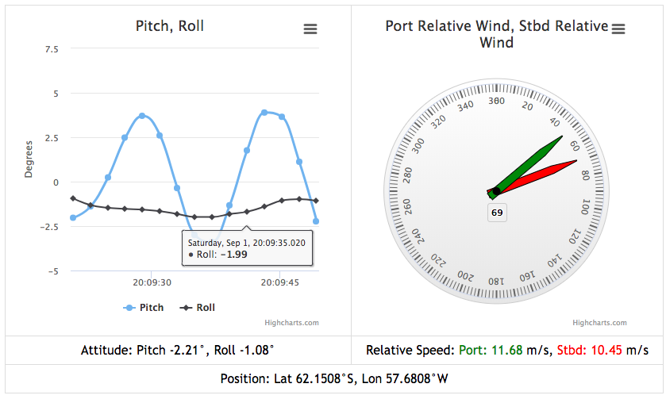

# OpenRVDAS Widget Examples

## First things first

Please see the [README.md file in the parent directory](../README.md)
for an introduction to the OpenRVDAS system. This document
specifically describes the creation of Javascript-based data display
widgets in HTML pages.

**NOTE:** Some of the widgets in this directory rely on the
[Highcharts library](https://www.highcharts.com/), others on
[Leaflet](https://leafletjs.com/). Users of these widgets are
responsible for ensuring that they have the appropriate licenses to
use those libraries.

**NOTE #2:** In order for the widgets described here to work, you must
copy the [settings.js.dist](static/js/widgets/settings.py.dist) file
in [static/js/widgets/](static/js/widgets/) over to settings.py and
set the WEBSOCKET_SERVER definition in that file to match the name
used by your installation (if you have used one of the installation
scripts in the [utils directory](../utils), this will have already
been done for you.)

## Overview

The OpenRVDAS [logger_manager.py](../server/logger_manager.py) script
can be invoked with an option that instructs it to instantiate a
DataServer and serve stored logger data on request via a
websocket. The widgets defined in this directory make use of that
functionality, attempting to connect to the data server and
graphically displaying the data they receive in a table, line chart,
map or dial.

For example, when the logger manager is running a data server on the
project's included test data, opening [demo.html](demo.html) in a web
browser should generate the following live display, illustrating the
use of a TimelineWidget, DialWidget, and a set of TextWidgets:



A fourth widget type, MapWidget, is demonstrated by
[map_demo.html](map_demo.html) (note: example image does not show an
actual ship track):


## Demo files

The demo files in this directory assume that a logger manager is
running with a websocket server active on port 8765 and the sample
cruise definition from
[test/configs/sample_cruise.json](../test/configs/sample_cruise.json)
loaded and in underway mode:

  ```
  # Create simulated serial ports and serve stored data in background
  logger/utils/simulate_serial.py \
      --config test/serial_sim.json  --loop &

  # Start logger manager, tell it to initialize a server on port 8765,
  # then load and run sample cruise in "underway" mode
  server/logger_manager.py --websocket :8765 \
      --config test/configs/sample_cruise.json \
      --mode underway
  ```

Note that 'underway' mode attempts to create DatabaseWriters and write
to whatever database has been configured in database/settings.py (see
[database/README.md](../database/README.md) for details). The data
server reads and serves its data from this database, so if none is
configured, no data will be served and displayed.

## Sample Use

When the logger manager script is running as described above, it will
attempt to serve data requests (see the [OpenRVDAS server
README.md](../server/README.md) for details on running the logger manager).

The widgets defined in this directory, when initialized, will attempt
to connect to the server's websocket and retrieve data for display. To
run a widget, you need four sections in your HTML page:

### 1. A DIV/SPAN container

Widgets, are inserted into DIVs and SPANs defined in a
page's HTML. Below, we have defined three container DIVs:

  ```
  <div id="line-container" style="height: 400px; min-width: 310px"></div>
  <div id="dial-container" style="height: 400px; min-width: 310px"></div>
  <table id=ship_table>
    <tr>
      <td>Position:</td>
      <td>
        <span id="gps_lat"></span>°
        <span id="gps_n_or_s"></span>
      </td>
    </tr>
  </table>
  ```

### 2. Javascript to instantiate the widget in the container

We now need to write the code that will insert widgets into those
DIV and SPAN containers. We do this by creating an array of widget
objects, each associated with one container. We then pass that array
to a WidgetServer object and tell it to start serving:

  ```
  <script type="text/javascript">
  [definition of line_fields, dial_fields and gps_lat_fields here]

  var widget_list = [];
  widget_list.push(new TimelineWidget('line-container', line_fields, 'Degrees'));
  widget_list.push(new DialWidget('dial-container', dial_fields));
  widget_list.push(new TextWidget('gps_lat_container', gps_lat_fields));
  widget_list.push(new TextWidget('gps_n_or_s', gps_n_or_s_fields));

  var widget_server = new WidgetServer(widget_list, 'localhost:8765');
  widget_server.serve();

  </script>
  ```

### 3. Field definitions

We still need to define `line_fields`, `dial_fields` and
`gps_lat_fields` as used above. These are, at their simplest,
associative arrays where the keys are the names of the data fields to
be displayed, and the values are arrays of properties:

  ```
  //////////////////
  // A line widget
  var line_fields = {
    S330Pitch: {
      name: "Pitch",
      seconds: 30
    },
    S330Roll: {
      name: "Roll",
      seconds: 30
    }
  };

  //////////////////
  // A dial
  var dial_fields = {
    MwxPortRelWindDir: {
      name: 'Port Relative Wind',
      color: 'red',
    },
    MwxStbdRelWindDir: {
      name: 'Stbd Relative Wind',
      color: 'green',
    }
  };

  //////////////////
  // Two concatenated fields, the first with some formatting
  var gps_lat_fields = {
    S330Lat: {
      name: "Latitude",
      transform: function(val) {
        return 'Lat ' + Math.round(val*100)/10000  + '°';
      }
    }
  };
  var gps_n_or_s_fields = {
    S330NorS: {
      name: "N/S"
    }
  };
  ```

More detailed documentation is necessary on what properties are
recognized by the TimelineWidget, DialWidget and TextWidget; for now
please consult the rapidly-changing code itself in this directory.

Some properties:

1. **name** - used by Highcharts when displaying axes and legends
2. **seconds** - for TimelineWidget, how many seconds of back data to display.
3. **color** - what color dial/line to draw for the specified field
4. **transform()** - a function that should be applied to the the
   retrieved value prior to passing it on to the widget. In the above
   examples, gps\_lat\_fields includes a transform that divides the
   returned value by 100, rounds it and prefixes/suffixes text to the
   entry.

### 4. Including the Javascript Widget/Server source

The last piece we have omitted is inclusion of the Javascript files
that define the widgets and their server. Which files we include
depends on which widgets we are using.

  The TimelineWidget and DialWidget use Highcharts code, so you'll
  need the following lines in your HTML to use them:

  ```
  <script src="/static/js/jquery/jquery-3.1.1.min.js"></script>
  <script src="/static/js/highcharts/stock/highstock.js"></script>
  <script src="/static/js/highcharts/stock/modules/exporting.js"></script>
  <script src="/static/js/highcharts/stock/modules/export-data.js"></script>
  <script src="/static/js/highcharts/code/highcharts-more.js"></script>
  <script src="/static/js/highcharts/code/modules/data.js"></script>

  <script src="/static/js/widgets/highcharts_widget.js"></script>
  <script src="/static/js/widgets/widget_server.js"></script>
  ```

  For the TextWidget, you'll just need

  ```
  <script src="/static/js/widgets/text_widget.js"></script>
  <script src="/static/js/widgets/widget_server.js"></script>
  ```

  For the MapWidget, you'll need

  ```
  <!-- Basic leaflet/jquery scripts. Leaflet's JS must come *after* is CSS. -->
  <script src="/static/js/jquery/jquery-3.1.1.min.js"></script>
  <link rel="stylesheet" href="/static/css/leaflet/leaflet.css" />
  <script src="/static/js/leaflet/leaflet.js"></script>

  <script src="/static/js/widgets/map_widget.js"></script>
  <script src="/static/js/widgets/widget_server.js"></script>

  <!-- Style sheet for this map demo -->
  <link rel="stylesheet" href="/static/css/map_demo.css" />
  ```

### Overriding widget options

One optional parameter is worth noting for TimelineWidget() and
DialWidget(): both accept an additional `widget_options` argument
that, if provided, should be an associative array of options to
override any/all of the default widget options defined in
highcharts_widgets.js.

### Creating other types of widgets

It should be (relatively) straightforward to create arbitrary types of
widgets beyond TimelineWidget, DialWidget and TextWidget. The only
requirements that the WidgetServer places on objects it serves is that
they contain two properties:

1. `this.fields`: an associative array whose keys are the names of the
       desired data fields.

2. `this.process_message(message)`: a method that receives an associative
       array whose keys are data field names and whose values are lists
       of [timestamp, value] pairs.

Any object containing these properties may be passed to the
WidgetServer. The server will request data for variables matching the
keys in `this.fields` and, when received, will pass the result to
`this.process_message(message)`, where `message` will be of the format

```
{field_name1: [[timestamp, value], [timestamp, value],...],
 field_name2: [[timestamp, value], [timestamp, value],...],
 ...
}
```


## License

OpenRVDAS is made available  under the MIT license:

  ```
  Copyright (c) 2017-2018 David Pablo Cohn

  Permission is hereby granted, free of charge, to any person obtaining a copy
  of this software and associated documentation files (the "Software"), to deal
  in the Software without restriction, including without limitation the rights
  to use, copy, modify, merge, publish, distribute, sublicense, and/or sell
  copies of the Software, and to permit persons to whom the Software is
  furnished to do so, subject to the following conditions:

  The above copyright notice and this permission notice shall be included in all
  copies or substantial portions of the Software.

  THE SOFTWARE IS PROVIDED "AS IS", WITHOUT WARRANTY OF ANY KIND, EXPRESS OR
  IMPLIED, INCLUDING BUT NOT LIMITED TO THE WARRANTIES OF MERCHANTABILITY,
  FITNESS FOR A PARTICULAR PURPOSE AND NONINFRINGEMENT. IN NO EVENT SHALL THE
  AUTHORS OR COPYRIGHT HOLDERS BE LIABLE FOR ANY CLAIM, DAMAGES OR OTHER
  LIABILITY, WHETHER IN AN ACTION OF CONTRACT, TORT OR OTHERWISE, ARISING FROM,
  OUT OF OR IN CONNECTION WITH THE SOFTWARE OR THE USE OR OTHER DEALINGS IN THE
  SOFTWARE.
  ```

## Additional Licenses

Highcharts is a software library made available by
[http://www.highcharts.com](http://www.highcharts.com) under the
Creative Commons (CC) Attribution-NonCommercial licence.

  Several of the libraries are included here to support a demonstration
  of how Highcharts may be used to display OpenRVDAS data. **Users of
  OpenRVDAS who wish to use Highcharts are responsible for ensuring that
  they have the proper licenses to use Highcharts in their
  installation.** Please see the [Highcharts Licensing
  FAQ](https://shop.highsoft.com/faq/licensing) for details.

[Leaflet](https://leafletjs.com/) is a software library made available under the [2-clause BSD license](https://github.com/Leaflet/Leaflet/blob/master/LICENSE):

  ```
  Copyright (c) 2010-2018, Vladimir Agafonkin
  Copyright (c) 2010-2011, CloudMade
  All rights reserved.

  Redistribution and use in source and binary forms, with or without modification, are
  permitted provided that the following conditions are met:

     1. Redistributions of source code must retain the above copyright notice, this list of
        conditions and the following disclaimer.

     2. Redistributions in binary form must reproduce the above copyright notice, this list
        of conditions and the following disclaimer in the documentation and/or other materials
        provided with the distribution.

  THIS SOFTWARE IS PROVIDED BY THE COPYRIGHT HOLDERS AND CONTRIBUTORS "AS IS" AND ANY
  EXPRESS OR IMPLIED WARRANTIES, INCLUDING, BUT NOT LIMITED TO, THE IMPLIED WARRANTIES OF
  MERCHANTABILITY AND FITNESS FOR A PARTICULAR PURPOSE ARE DISCLAIMED. IN NO EVENT SHALL THE
  COPYRIGHT HOLDER OR CONTRIBUTORS BE LIABLE FOR ANY DIRECT, INDIRECT, INCIDENTAL, SPECIAL,
  EXEMPLARY, OR CONSEQUENTIAL DAMAGES (INCLUDING, BUT NOT LIMITED TO, PROCUREMENT OF
  SUBSTITUTE GOODS OR SERVICES; LOSS OF USE, DATA, OR PROFITS; OR BUSINESS INTERRUPTION)
  HOWEVER CAUSED AND ON ANY THEORY OF LIABILITY, WHETHER IN CONTRACT, STRICT LIABILITY, OR
  TORT (INCLUDING NEGLIGENCE OR OTHERWISE) ARISING IN ANY WAY OUT OF THE USE OF THIS
  SOFTWARE, EVEN IF ADVISED OF THE POSSIBILITY OF SUCH DAMAGE.
  ```
